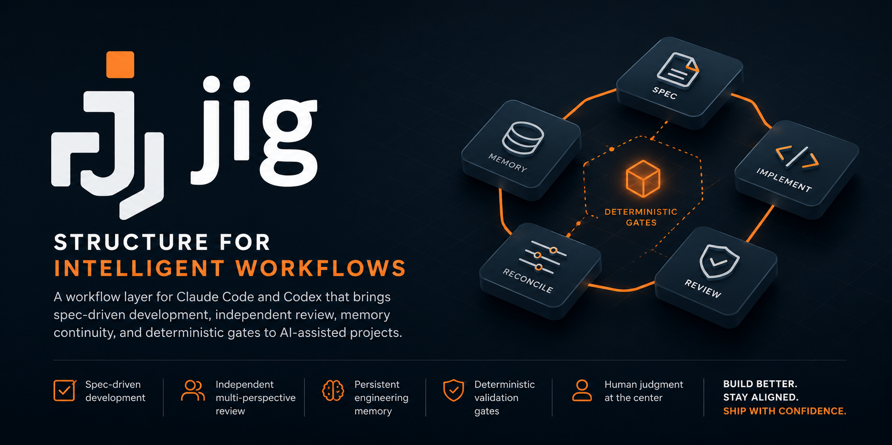

> A Claude Code and Codex workflow layer that scaffolds AI-native development practices into new projects.

**jig** (noun): a tool that guides other tools to work accurately and consistently.

## Why jig

Two years of AI-assisted coding leave the same scars on every non-trivial
project: LLMs refactor whole layers before anything works end-to-end, "done"
drifts because no acceptance criteria are written down, implementers grade
their own homework, and mega-packs burn the context budget before your work
loads. **jig encodes the workflow that prevents each one — so you don't
rediscover it session by session.**

→ **[The jig philosophy](docs/philosophy.md)** — the full why: the named
scars, how jig thinks, and the honest objections.

## What it does

Idea → Spec → Vertical slice → Implementation → Independent review → Reconciliation → Done

jig installs a focused, opinionated workflow layer into your project:

- **Spec-driven development** — SPIDR-split vertical slices, each with its own
  Definition of Done.
- **Multi-perspective review** — a fresh, read-only reviewer checks every
  slice against its spec (compliance), plus a craft pass and an on-demand
  architecture pass.
- **Memory layer** — cross-session continuity via hot cache + deep storage +
  inbox.
- **Deterministic gates** — hooks enforce what *must* happen; skills carry
  judgment.

A fixed, opinionated set — **7 Tier 0 skills** at the floor and 12 more on by
default (Tier 1) — not a hundred-skill marketplace. For the full picture, see
[product-vision.md](docs/product-vision.md) (vision, target users, principles)
and [architecture.md](docs/architecture.md) (mechanics).

## Principles jig encodes

The convictions behind the mechanisms — each one wired into something concrete,
not left as advice:

- **The harness matters more than the model.** jig *is* a harness: the
  instructions an agent reads, the tools it can run, the feedback loops that
  correct it, the isolation boundaries that contain it. Swapping models won't
  close a workflow gap — the scaffold does.
- **Guardrails, not guidelines.** What *must* happen is enforced mechanically by
  deterministic gates: hooks for immediate local checks (secret scanning,
  spec-file gates) and workflow transitions for lifecycle evidence
  (review-evidence gates, reconciliation artifacts). What takes *judgment*
  lives in skills. The line between a deterministic gate and an advisory nudge
  is drawn on purpose.
- **The context window is working memory, not a storage buffer.** Irrelevant
  context degrades reasoning, so jig keeps a lean hot cache, loads deeper docs
  on demand, and delegates file-heavy reading to subagents that return only a
  summary.
- **Designed to reduce token cost.** Beyond keeping context lean for *quality*,
  jig is built to keep token usage — and the bill — *down*: lean context,
  file-heavy reading delegated to subagents, tight output. It also measures its
  own spend rather than guessing at it.
- **Review is the bottleneck.** Agents produce faster than review capacity
  grows, so jig won't let implementers grade their own homework: a fresh,
  read-only reviewer checks every slice against its spec, and the verdicts are
  durable artifacts that gate the next state.
- **Specs and docs are code, and they ship in slices.** Specs, ADRs, and the
  memory layer are version-controlled and reconciled before a slice lands — so
  "done" never drifts, and work arrives as vertical slices instead of one big-bang
  mega-commit.

These are the outward-facing worldview; several are also load-bearing build
rules jig holds *itself* to, spec by spec — see
[product-vision § Design principles](docs/product-vision.md#design-principles)
for the operational detail.

jig now ships one development experience across Claude Code and Codex: the same
workflow model, rendered into host-native files by the host-adapter layer
([spec 033](docs/specs/033-host-adapter-portability/spec.md)). The next big
horizon is **coordination across a multi-repo workspace** (a federation tier —
[spec 034](docs/specs/034-federation-tier/spec.md)).

## Start here

**New to jig?** Read the
**[adoption & readiness guide](docs/adoption-readiness.md)** first — who jig is
for, what your repo needs, and your first 30 minutes.

Then, in a Claude Code or Codex session at your project root:

```text
Set up this project for AI-native development.
```

(or the explicit `/jig:scaffold-init`). This copies jig's docs, skills, hooks,
and host config into your repo: Claude gets `CLAUDE.md` + `.claude/`; Codex gets
`AGENTS.md` + `.codex/`. The scaffold seeds a worked-example spec and runs a
"scaffold complete and verified" check. Follow it with `/jig:vision-elicitation`
to set the vision every later slice is judged against.

**Copy-paste prompts** live in the **[prompt cookbook](docs/prompts.md)**, in
the order you run them: scaffold the repo once, then repeat the idea-to-landed
loop for every feature.

### Install

**Claude plugin**

```text
/plugin marketplace add ramboz/jig
/plugin install jig@jig
```

**Claude scaffold**

```bash
git clone https://github.com/ramboz/jig.git
python3 jig/hosts/claude/skills/scaffold-init/scaffold.py <your-project>
```

**Codex plugin**

```bash
codex plugin marketplace add ramboz/jig
codex plugin add jig@jig
```

**Codex scaffold**

```bash
git clone https://github.com/ramboz/jig.git
python3 jig/hosts/codex/plugins/jig/skills/scaffold-init/scaffold.py --host codex <your-project>
```

## Extension points

> **Bring your own depth; jig provides the floor.**

A few jig skills — `pr-review`, `arch-review`, `contracts`, `security-review`,
`code-health`, `explain`, `vision-elicitation` — ship as lightweight baselines
that **defer to a richer user-installed skill** in the
same category when one is present. The deferral is category-based, not
name-specific, so your own reviewer skill wins automatically, with no
configuration. jig stays opinionated about *workflow* and out of the way of
the *judgment skills you've already invested in*. Detail:
[product-vision § Design principles](docs/product-vision.md#design-principles).

## Verifying a host install

Each host is verified **in its own environment** — one host's check does not
prove the other installs and runs:

- **Claude:** `python3 scripts/verify_install.py` confirms the install
  footprint, and `python3 scripts/build_release_zip.py --host claude
  --smoke-test <zip>` exercises the committed `hosts/claude` package. Spec
  061-06 owns the full Claude install-verification slice.
- **Codex:** `python3 scripts/codex_install_smoke.py` validates the committed
  `hosts/codex` package and probes a live Codex CLI when present. Spec 061-07
  owns the full Codex install-verification slice.

### From source (contributors)

See [CONTRIBUTING.md](CONTRIBUTING.md) for the local-marketplace
workflow used during development.

## Getting started

Once installed, open a new project directory in Claude Code and say:
> "Set up this project for AI-native development"

The `scaffold-init` skill will run and produce the docs/ scaffolding.

## Repository structure (for contributors)

Three peers: the **canonical source root**, the committed **`hosts/claude`**
package, and the committed **`hosts/codex`** package. The two host packages are
**committed, source-derived build outputs** — kept fresh by the drift guard
(`python3 scripts/build_host_packages.py [--check]`) and **NOT hand-edited**.
The host packages have **different internal shapes**: Claude is a **flat**
plugin (`.claude-plugin/plugin.json` at the package root) while Codex is
**marketplace-wrapped** (`hosts/codex/.agents/plugins/marketplace.json` +
`hosts/codex/plugins/jig/...`).

```
# Canonical source root (dev tooling + the tree the host packages build from):
.claude-plugin/plugin.json       # Claude plugin source manifest
.claude-plugin/marketplace.json  # remote-install pointer → ./hosts/claude
.agents/plugins/marketplace.json # Codex remote-install pointer → ./hosts/codex/plugins/jig
.codex-plugin/plugin.json        # Codex plugin source manifest
skills/                          # Skill definitions (SKILL.md per skill)
agents/                          # Subagent definitions
hooks/                           # Hook configuration + Python scripts
scripts/                         # Top-level dev scripts (verify-install, …)
templates/                       # Source templates scaffold-init generates from
docs/                            # Dev docs for jig itself (dogfooded workflow)
  specs/                         # Specs for jig's own features
  memory/                        # jig's own memory layer
  decisions/                     # Architectural decisions (ADRs)

# Committed, drift-guarded host packages (built from source; NOT hand-edited):
hosts/
  claude/                        # COMMITTED flat Claude plugin package
  codex/                         # COMMITTED marketplace-wrapped Codex package
    .agents/plugins/marketplace.json
    plugins/jig/                 # the Codex plugin tree
dist/                            # gitignored — host-explicit release ZIPS ONLY
```

## Contributing

Read [CONTRIBUTING.md](CONTRIBUTING.md) for the local install + verify flow,
then [docs/workflow.md](docs/workflow.md) for the spec lifecycle. **Every
change to jig starts with a spec.** PRs squash-merge with conventional-commit
titles (`feat(scope): …` / `fix(scope): …`); the `pr-title.yml` workflow
enforces the shape, and CONTRIBUTING § Releasing has the version-bump effect of
each prefix.

How jig compares against other AI-native playbooks — and where each known gap
is owned — lives in
[CONTRIBUTING § Comparison and gap response](CONTRIBUTING.md#comparison-and-gap-response).

## Status

Tier 0 and Tier 1 are complete — all 19 skills, 3 subagents, and the jig hooks
ship today, and jig is dogfooded on its own spec lifecycle. For live per-slice
state, see the **[status board](docs/specs/README.md)**.

**Supported today:** Claude Code and Codex in scaffold and plugin shapes from
the shared source tree. Codex role prompts are bundled as prompt source, rendered
to TOML for scaffold mode, and installable for plugin users via the explicit
Codex agent helper; plugin-native Codex custom-agent discovery remains the
tracked follow-up in [spec 033](docs/specs/033-host-adapter-portability/spec.md).
