> Status: Draft (technical mechanics; vision and design principles live in [product-vision.md](product-vision.md))
>
> This document evolves as we make decisions. Open questions are explicit, not papered over.

# Architecture: jig

> For *what jig is*, *who it's for*, and *why it works the way it does*, see
> [product-vision.md](product-vision.md). This document covers the technical
> mechanics: plugin structure, hook spine, subagent roster, module boundaries,
> open architectural questions.

## Plugin structure

```
jig/
├── .claude-plugin/plugin.json     # Manifest
├── .codex-plugin/plugin.json      # Codex plugin manifest
├── skills/                        # Claude Code skills (auto-trigger + /menu)
├── agents/                        # Subagent definitions (implementer, reviewer, architect)
├── hooks/                         # Deterministic enforcement layer
│   ├── hooks.json
│   └── scripts/                   # shell/Python hook helpers (no jq dependency)
├── templates/                     # Source templates scaffold-init reads
└── docs/                          # Dev docs for building jig itself (dogfooded)
```

This is still the canonical source tree. Claude plugin mode reads these
files directly from the installed plugin; Claude and Codex scaffold modes
materialize host-native copies into the target project. Codex plugin mode
materializes a plugin package from the same source via
`scripts/build_codex_plugin.py`, rewriting only the staged skill copies.
Future host adapters should render from the same source rather than fork
the workflow model.

## Host support matrix

| Host | Distribution | Status | Notes |
|---|---|---|---|
| Claude Code | Plugin | v1 supported | Existing `.claude-plugin` package remains valid. |
| Claude Code | Scaffold | v1 supported | Existing `.claude/` scaffold output remains the default ownership model. |
| Codex | Scaffold | v2 supported | Project-local output lives under `AGENTS.md` and `.codex/`. |
| Codex | Plugin | v2 supported | `.codex-plugin/plugin.json` plus rendered Codex skills, root `hooks/hooks.json`, templates, and canonical agent prompts are produced by `scripts/build_codex_plugin.py`. |
| Other harnesses | Any | out of scope | Future adapters need their own real user signal and spec slices. |

## Host adapter boundary

The architecture boundary is between jig's **logical workflow model**
and a host's **materialized runtime files**. Jig keeps one source for
skills, agent instructions, hook scripts, docs templates, and helper
code; each host adapter renders the files that a specific harness knows
how to load.

Every adapter must account for the same logical operations:

1. **Primer rendering.** Produce the project primer files the host reads
   at session start. New scaffolded projects use `AGENTS.md` as the
   canonical primer; Claude v1 keeps `CLAUDE.md` as the Claude Code adapter.
2. **Skill installation.** Copy or render jig skills into the host's
   project-scoped skill directory, rewriting helper paths only inside
   the adapter.
3. **Agent installation.** Render `implementer`, `reviewer`, and
   `architect` into the host's custom-agent format while preserving the
   intended capability shape.
4. **Hook installation.** Register the seven logical jig hooks against
   host-native lifecycle events.
5. **Hook protocol translation.** Convert jig-level results into the
   host protocol. The logical outcomes are `continue`,
   warning context, and blocking reasons; exit codes and JSON shapes are
   host-specific.
6. **Path/environment binding.** Bind project root and jig runtime root
   through host-neutral `JIG_*` conventions or self-location, with tiny
   host adapters translating from host-specific environment variables
   such as `CLAUDE_PLUGIN_ROOT`.
7. **Managed-file metadata.** Mark or manifest generated files so future
   update tooling can distinguish untouched jig-managed files from
   user-edited copies.
8. **Verification fixtures.** Provide stable generated-tree and hook
   protocol fixtures so adapter behavior can be tested without opening
   an interactive host session.

The implementation keeps Claude behavior in place while defining this
boundary. Codex scaffold generation writes `.codex/` project-local
runtime files. Codex plugin packaging uses the same source tree and a
build-time renderer so plugin users get Codex-shaped skill prose without
checking in a second skill tree.

## Claude runtime wiring

How a session actually flows in Claude plugin-install mode. The LLM layer
(user → Claude → skill router → SKILL.md → helper or subagent → on-disk
state) is non-deterministic; the ten hooks form the deterministic spine
that fires on fixed events and can inject context or block tool calls.

```mermaid
flowchart TB
    user([User message])
    claude[Claude]
    router{{Skill router<br/>auto-trigger by description}}
    skill["SKILL.md body<br/>(progressive load)"]

    user --> claude
    claude --> router
    router --> skill
    skill -->|bash recipe| helpers["scripts/*.py<br/>workflow · review · adr · tdd<br/>land · migrate · scaffold"]
    skill -->|Task tool| subs["Subagents<br/>implementer (writes)<br/>reviewer (read-only)<br/>architect (rare)"]

    helpers --> jig[(.jig/scaffold.json)]
    helpers --> adrs[(docs/decisions/)]
    helpers --> specs[(docs/specs/)]
    subs --> specs
    subs --> memory[(CLAUDE.md<br/>+ docs/memory/)]

    subgraph hookspine["Deterministic spine — 13 hooks"]
        direction TB
        h1["SessionStart · UserPromptSubmit · PreToolUse·Read<br/>jig-context-check<br/>context-fill + in-session growth/compact nudge"]
        h2["UserPromptSubmit<br/>jig-memory-scan<br/>surface unknown references"]
        h3["PreToolUse · Task<br/>jig-telemetry<br/>async log, never blocks"]
        h4["PreToolUse · Skill<br/>jig-skill-trace<br/>async skill-routing log, never blocks"]
        h5["PreToolUse · Edit/Write<br/>jig-spec-gate<br/>blocks conventions.md edits"]
        h6["PreToolUse · Edit/Write<br/>jig-secret-scan<br/>blocks high-confidence secrets"]
        h7["PostToolUse · Edit/Write<br/>jig-post-edit-verify<br/>same-turn edit-landed check"]
        h8["PostToolUse · Edit/Write<br/>jig-boundary-change-warn<br/>nudge ADR on contract-artifact edit"]
        h9["Stop<br/>jig-task-capture<br/>surface TODOs next turn"]
        h10["SessionStart<br/>jig-semantic-index<br/>ready opted-in provider or suggest once"]
        h11["Stop<br/>jig-decision-capture<br/>surface decision candidates next turn"]
        h12["PostToolUse·AskUserQuestion · UserPromptSubmit<br/>jig-decision-inflight<br/>async write-only: in-flight decision stubs to scratch"]
        h13["Stop<br/>jig-claim-check<br/>flag unresolved spec/slice/ADR claims next turn"]
    end

    h1 -. additionalContext .-> claude
    h2 -. additionalContext .-> claude
    h5 -. exit 2 = blocks Edit .-> claude
    h6 -. exit 2 = blocks Edit .-> claude
    h7 -. additionalContext .-> claude
    h8 -. additionalContext .-> claude
    h10 -. additionalContext .-> claude
    h9 -. next-turn context .-> claude
    h11 -. next-turn context .-> claude
    h13 -. next-turn context .-> claude
```



- **Skill router** is a Claude Code internal — it auto-matches the user's message against every `SKILL.md` `description` field and loads the first match. Skills marked `disable-model-invocation: true` are skipped.
- **`bash recipe` arrow**: most `SKILL.md` bodies end with a deterministic bash block that calls the matching `.py` helper. Skills without a helper (`pr-review`, `arch-review`, `contracts`, `vision-elicitation`, plus the slice-to-spec workflow inside `migrate`) are judgment-only. `pr-review` and `arch-review` stay judgment-only as skills, but are *invoked* deterministically from the post-implementation flow via `review.py pr-review` / `review.py arch-review` prompt builders (see [skills/spec-workflow/SKILL.md](../skills/spec-workflow/SKILL.md) § "After implementation").
- **`Task tool` arrow**: `SKILL.md` can dispatch a fresh subagent via the `Task` tool. The three roles in `agents/` (`implementer`, `reviewer`, `architect`) are real `subagent_type` values when jig is installed as a plugin; outside the plugin they fall back to `general-purpose`.
- **Hook spine** intercepts at five Claude Code event types (SessionStart, UserPromptSubmit, PreToolUse, PostToolUse, Stop) via thirteen hook scripts. Two are async log-only — never block, never inject (`telemetry`, `skill-trace`); one is async write-only — captures in-flight decision stubs to a per-session scratch log, never blocks or injects (`decision-inflight`, spec 083-07); eight can inject `additionalContext` (`context-check`, `memory-scan`, `post-edit-verify`, `boundary-change-warn`, `task-capture`, `decision-capture`, `jig-semantic-index`, `claim-check`); two can block tool calls with exit-code 2 (`spec-gate`, `secret-scan`). The three Stop hooks (`task-capture`, `decision-capture`, `claim-check`) are siblings — same scan-and-surface pattern applied to a different signal (tasks, decisions, and — per the refinement-todo "memory-recall verification" mitigation — spec/slice/ADR claims that don't resolve on disk); `decision-inflight` is the deterministic fast path feeding `decision-capture`'s triage (spec 083-07).

Scaffold-mode wiring is identical in shape — only path strings differ
(`${CLAUDE_PROJECT_DIR}/.claude/...` instead of `${CLAUDE_PLUGIN_ROOT}/...`).
See the **Dual-distribution** decision below for the rewrite details.

## Core architecture decisions

### Hooks are the deterministic spine; skills are the LLM layer
*Principle:* see [product-vision.md § Design principles](product-vision.md#design-principles) (#1).
*Mechanics:* hook entries live in `hooks/hooks.json` and run unconditionally on their declared event; skill entries live in `skills/<name>/SKILL.md` and auto-trigger via description matching against user messages.

### Hook scripts: Python 3, never jq
`jq` is not installed by default on macOS. All hook scripts use inline `python3 -c` for JSON parsing. Python 3 is reliably available.

### Hook command paths: `${CLAUDE_PLUGIN_ROOT}/hooks/scripts/...`
Plugin `bin/` PATH injection is Bash-tool only, not hook commands. All hook `command` fields use the full `${CLAUDE_PLUGIN_ROOT}` path.

### Dual-distribution: plugin install AND scaffolded install
*Principle:* [product-vision.md § Design principles](product-vision.md#design-principles) (#7) — dev owns the scaffolding, not the plugin runtime.

As of [spec 016-scaffold-mode](specs/016-scaffold-mode/spec.md) (slices
016-01 + 016-02 + 016-03 all DONE; 016-04 deferred), `scaffold-init` copies the
runtime machinery (`skills/`, `agents/`, `hooks/scripts/`) into the
user's `.claude/` directory under `jig-` prefixed names
(`.claude/skills/jig-<name>/`, `.claude/agents/jig-<name>.md`,
`.claude/hooks/scripts/jig-*.sh`), and generate/merge
`.claude/settings.json` to register the ten jig hooks against the
project-local script paths. SKILL.md path strings are rewritten from
`${CLAUDE_PLUGIN_ROOT}/skills/<name>/` to
`${CLAUDE_PROJECT_DIR}/.claude/skills/jig-<name>/`, and hook command
paths from `${CLAUDE_PLUGIN_ROOT}/hooks/scripts/` to
`${CLAUDE_PROJECT_DIR}/.claude/hooks/scripts/`, both at copy time.

The settings.json merge follows an **append-with-marker** strategy
(slice 016-02): every jig-managed hook entry carries
`metadata: {managed_by_jig: true}`. Pre-existing non-hook top-level
fields (`permissions`, `env`, etc.) pass through verbatim;
pre-existing non-jig hooks survive; jig entries replace in place on
re-run (idempotent). A safety check (`UnmanagedHooksError`, exit 3)
refuses to write when the existing settings.json has hooks but none
carry the jig marker — `--force` is the documented escape.

The plugin distribution (zip + marketplace) is unchanged; the source
SKILL.md files and `hooks/hooks.json` keep their `${CLAUDE_PLUGIN_ROOT}`
paths. Only the scaffold path rewrites. Coexistence between scaffolded
and plugin installs falls under Claude Code's normal
project-scoped-wins precedence; jig introduces no new arbiter.

### Codex plugin packaging
*Principle:* same workflow model, host-native materialization.

Codex plugin mode uses `.codex-plugin/plugin.json` and the same root
`hooks/hooks.json` default path that Codex documents for plugins. Codex
sets `PLUGIN_ROOT` for plugin hooks and keeps `CLAUDE_PLUGIN_ROOT`
compatible, so the canonical hook registrations remain unchanged for
Claude plugin mode and continue to work in Codex plugin mode.
Codex still treats plugin-bundled command hooks as non-managed hooks:
users must review and trust them through `/hooks` before jig's hook gates
run, and changed hook definitions require renewed trust.

`scripts/build_codex_plugin.py` produces the installable Codex plugin
directory plus a generated `.agents/plugins/marketplace.json` beside it.
It copies `.codex-plugin/`, `hooks/`, `templates/`, and `agents/` from
the shared source, then renders `skills/**/SKILL.md` into Codex wording
and plugin-root helper paths in the staged copy only. It also renders
TOML custom-agent templates from the canonical Markdown prompts. The
checked-in `skills/` and `agents/` trees stay the canonical source for
Claude plugin, Claude scaffold, Codex scaffold, and Codex plugin packaging.

Codex's current custom-agent discovery uses TOML files under project-local
or user-local `.codex/agents/`. Plugin packaging therefore does not add an
unsupported `agents` field to `.codex-plugin/plugin.json`; plugin users run
an explicit post-install helper to copy the generated `jig-*.toml` files into
their chosen Codex agents directory.

**Codex plugin agent-discovery spike (059-06).** The official Codex manual
was rechecked on 2026-06-05: `plugins/build` documents `.codex-plugin/plugin.json`
with `skills`, while `plugins` describes plugin bundles as skills, apps, and
MCP servers, and `subagents` documents custom agents as standalone TOML files
under `.codex/agents/` or `~/.codex/agents/`. Local `codex-cli 0.133.0` was
then probed through `scripts/codex_agent_discovery_probe.py` with an isolated
marketplace and temporary `CODEX_HOME`; the installed plugin cache retained
`agents/jig-*.toml`, but `codex debug prompt-input` did not expose those
plugin-bundled TOML files as custom agents. The explicit
`--install-codex-agents` helper remains the supported plugin contract until
official docs or the probe show plugin-native discovery.

### Context economy (the "dumb zone")
*Principle:* see [product-vision.md § Design principles](product-vision.md#design-principles) (#2).
*Mechanics:* the `jig-context-check` hook warns at session start when fill approaches the ~40% threshold, and nudges again on in-session growth as context crosses configurable bands (40/60/80%, plus a higher active-compaction band per spec 057-02). Skills use progressive disclosure — body loads only on trigger; supporting files load only when referenced.

### Three subagents, no more
*Principle:* see [product-vision.md § Design principles](product-vision.md#design-principles) (#3) — subagents are defined by what context they need isolated from, not by job title.

*Roster:*
- `implementer`: TDD discipline, writes deliverables
- `reviewer`: read-only, fresh context per review. Fires once per review pass under the multi-perspective flow — always compliance + craft (`pr-review`) + reconciliation, plus the frontmatter-gated passes: arch (`arch_review: true`), code-health (`code_health_review: true`, spec 060-05), design-review (`design_review: true`, spec 071-01, REVIEWED stage), and frame-critique (`frame_review: true`, spec 064-03, the PRE-implementation READY_FOR_REVIEW gate). Reused as the agent shape for every pass — no per-pass `pr-reviewer` / `arch-reviewer` agent. The verdicts are durable evidence artifacts that gate the next transition ([ADR-0014](decisions/adr-0014-review-evidence-model.md)).
- `architect`: rare, ADR-style output

As of [spec 011-01 (plugin-self-install)](specs/011-plugin-self-install/spec.md),
all three are reachable as real `subagent_type` values when jig is installed
as a Claude Code plugin (the bundled `jig` marketplace — renamed from
`jig-dev` in slice 013-04 — or any future public install). Pre-spec-011, every caller fell back to
`subagent_type: "general-purpose"`. Slice 011-02 added
`review.py subagent-type` so SKILL.md's bash recipe picks the real
`reviewer` deterministically when installed and degrades to
`general-purpose` when running from source.

### Decisions made since (pointers, not re-derivations)

The decisions above are the original load-bearing spine through ~spec 016.
Several structural decisions have landed since; rather than restate each, this
section points at the canonical ADRs (see the [ADR index](decisions/) for the
full set, currently through ADR-0027):

- **Review-evidence gate** — [ADR-0014](decisions/adr-0014-review-evidence-model.md): review verdicts are durable artifacts under `docs/specs/NNN-slug/reviews/` that gate REVIEWED / RECONCILED / DONE transitions.
- **Lifecycle-family spine** — [ADR-0023](decisions/adr-0023-lifecycle-family-spine.md): spec-workflow, bug-fix, and refactor are one governed family sharing a C1–C7 gated-evidence contract.
- **Pluggable-oracle boundary** — [ADR-0022](decisions/adr-0022-pluggable-oracle-boundary.md): the attest-only seam between jig and an external eval (e.g. servo), where jig attests a frozen verdict rather than re-deriving it.
- **Security floor** — [ADR-0013](decisions/adr-0013-security-floor-policy.md): the 5-part defense-in-depth floor every scaffolded project gets.

## Module boundaries

Six top-level concerns, named in [product-vision.md § Core features](product-vision.md#core-features-prioritized) at the vision layer:

- `skills/` — auto-triggering LLM behaviors (one `SKILL.md` + supporting files per skill)
- `agents/` — three subagent definitions (`implementer` / `reviewer` / `architect`)
- `hooks/` — deterministic spine (`hooks.json` + shell/Python hook helpers under `hooks/scripts/`)
- `templates/` — source templates that `scaffold-init` copies into new projects (`AGENTS.md`, `CLAUDE.md`, docs/, brief)
- skill helpers — Python helpers live **next to the skill that owns them** (`skills/<name>/*.py`), one per skill where the work is mechanical: `workflow.py`, `review.py`, `adr.py`, `tdd.py` (+ `quality.py`), `land.py`, `migrate.py`, `scaffold.py` (+ `stocktake.py`), `health.py` (code-health, spec 060), `bug.py` (bug-fix, spec 058), and `memory.py`. Shared stdlib-only helpers live in `skills/_common/` (`parsing.py`, `review_evidence.py`, `lexicon.py`, `team_signal.py`, `use_cases.py`, `scaffold_state.py`, `atomic_io.py`)
- `scripts/` — top-level repo tooling, not skill helpers: `usage.py` (per-spec token/cost reporting, spec 056), `verify_install.py`, `spec_lint.py`, `validate_manifests.py`, `skill_routing.py` (skill-routing eval, spec 086), `build_release_zip.py`, `build_codex_plugin.py`, the `*_contract.py` builders, and `run_tests.py`
- `.claude-plugin/` — Claude plugin manifest (`plugin.json`) + marketplace descriptor (`marketplace.json`)
- `.codex-plugin/` — Codex plugin manifest (`plugin.json`)
- `scripts/build_codex_plugin.py` — produces Codex plugin package output plus its generated marketplace descriptor

The host adapter boundary sits inside the scaffold/runtime-rendering
concern: shared helper logic stays source-centralized, while host
renderers own path rewrites, primer choice, agent format, hook
registration, and hook protocol translation.
`skills/scaffold-init/scaffold.py` currently exposes this boundary as a
host-neutral `HostRenderer` interface plus concrete renderers for Claude
(`ClaudeScaffoldRenderer`) and Codex (`CodexScaffoldRenderer`). Claude
scaffold mode writes `AGENTS.md`, `CLAUDE.md`, `.claude/skills/`,
`.claude/agents/`, `.claude/hooks/scripts/`, and `.claude/settings.json`.
Codex scaffold mode writes `AGENTS.md`, `.codex/skills/`,
`.codex/agents/*.toml`, `.codex/hooks/scripts/`, `.codex/templates/`, and
`.codex/hooks.json` without producing Claude-only files. The templates copy
is runtime support for scaffolded helpers whose source fallback resolves
template paths relative to the materialized jig runtime. Codex also installs
non-discoverable unprefixed helper aliases under `.codex/skills/<name>/`
without `SKILL.md`; these preserve existing peer-helper imports such as
`skills/scaffold-init/scaffold.py` without registering duplicate skills.
Codex agent files are generated TOML custom-agent definitions with the
closest supported `sandbox_mode` for each role; the canonical source prompts
remain the Markdown files in `agents/`.

**Codex role capability dogfood (059-05).** The generated role files use this
mapping: `jig-implementer` -> `workspace-write`, `jig-reviewer` ->
`read-only`, and `jig-architect` -> `read-only`. Local Codex CLI 0.133.0
validates those sandbox modes through `scripts/codex_role_capability_probe.py`:
the documented `:read-only` permissions profile blocks a scratch-project write
with `PermissionError: [Errno 1] Operation not permitted`, while `:workspace`
allows the same write inside the scratch workspace. Codex custom agents are
spawned only when explicitly requested and inspected through `/agent`;
`codex debug prompt-input` does not currently expose project custom-agent
entries, so noninteractive review automation should keep using generated
`review.py` prompts with a read-only runner unless the user is intentionally
dogfooding an interactive `jig-reviewer` custom-agent thread.

## Managed-File Metadata Policy

Scaffolded files are tracked with a **manifest-only** default: `scaffold.json`
records each managed file's relative path, source template/path, jig version,
host renderer, and `sha256` content hash. This keeps large prompt/prose files
such as `AGENTS.md`, `CLAUDE.md`, `docs/**`, skill `SKILL.md` bodies, and
agent prompts readable for LLMs instead of adding noisy per-file metadata
banners.

Inline markers are reserved for native host merge safety when the host file is
itself a structured merge surface. Today that means Claude hook entries inside
`.claude/settings.json` carry `metadata: {managed_by_jig: true}` so jig can
replace its own hook registrations without clobbering user-owned hooks. The
file-level source/hash record for `.claude/settings.json` still lives in
`scaffold.json`. Codex hook registration is generated as a whole
`.codex/hooks.json` file using Codex's native top-level `hooks` schema;
scaffold treats generated jig command paths under
`.codex/hooks/scripts/jig-*.sh` as the overwrite-safety marker and refuses
to overwrite an existing unrecognized Codex hook config unless the user passes
`--force`.

On a force re-run, scaffold checks manifest hashes before writing. Untouched
managed files may be regenerated; edited managed files cause a clear refusal
so the user can move or merge their change first. Missing managed files may be
regenerated. `scaffold.json` is the completion sentinel and manifest root, so
it is not self-hashed.

Interface contracts between the other modules are deliberately deferred
— today's coupling is read-only and one-directional (skills read
templates; helpers read specs; hooks read events; nothing writes across
the module boundary). Will tighten when the first bidirectional case
appears.

## Data model

Jig is a workflow layer, not a data application (per [product-vision.md](product-vision.md) non-goals). Relevant on-disk state is small:

- `.jig/scaffold.json` — install manifest: which tiers chosen, when, by which jig version (per [ADR-0001](decisions/adr-0001-scaffold-stable.md))
- `.jig/semantic-index.json` — project-local semantic-index opt-in state: auto-attach permission, provider preference, allowed overlays, and worktree policy (spec 080)
- `.jig/semantic-index-events.jsonl` — content-free local activation telemetry written by the semantic-index helper; ignored by git alongside `.jig/semantic-index-claude-hook.json`, the Claude hook's one-time recommendation rate-limit file
- `.claude/skill-usage.jsonl` — append-only log written by `jig-telemetry.sh` (Task spawns; `event: task_spawned`, with optional `phase`/`spec`/`slice`) and `jig-skill-trace.sh` (Skill invocations; `event: skill_invoked`); read via [docs/skill-routing-verification.md](skill-routing-verification.md). Histogram consumer is `workflow.py routing-stats` (slice 041-02)
- `docs/specs/**/spec.md` — the only project-level state jig owns; everything else lives in the dev's repo, owned by the dev

## Contract surfaces

<!-- elicited: 2026-05-15 / status: skipped -->

_Skipped: jig does not currently expose schema-shaped external interfaces. It is a dual-host plugin/scaffold package — the external surfaces are host plugin manifests, skill frontmatter/bodies consumed by Claude Code or Codex routers, Codex custom-agent TOML, hook configuration files, and CLI argparse interfaces on the `.py` helpers consumed by humans + scripts. None warrants an OpenAPI / JSON Schema / AsyncAPI / `.proto` / GraphQL SDL artifact. If jig later grows an HTTP / events / RPC surface (e.g. a telemetry sink endpoint, a remote-spec-status query API), this section gets filled per the `/jig:contracts` skill's per-surface recommendation table._

_Self-coherence note (spec 022-02): this slot exists so the `/jig:independent-review` reviewer-prompt's conditional contract-surface check stays quiet on jig's own slice reviews — the `status: skipped` marker + the no-bullet body together signal "no surfaces to check" to the detector. See [skills/contracts/SKILL.md](../skills/contracts/SKILL.md) for the per-surface recommendation table the elicitation references._

## Open questions

- `SubagentStart` hook event: documented in changelog (v2.0.43) but absent from official plugin docs. Deferred — see `docs/refinement-todo.md`.
- Hook strictness profiles (`SCAFFOLD_HOOK_PROFILE`): deferred — unread env var is worse than no env var.
