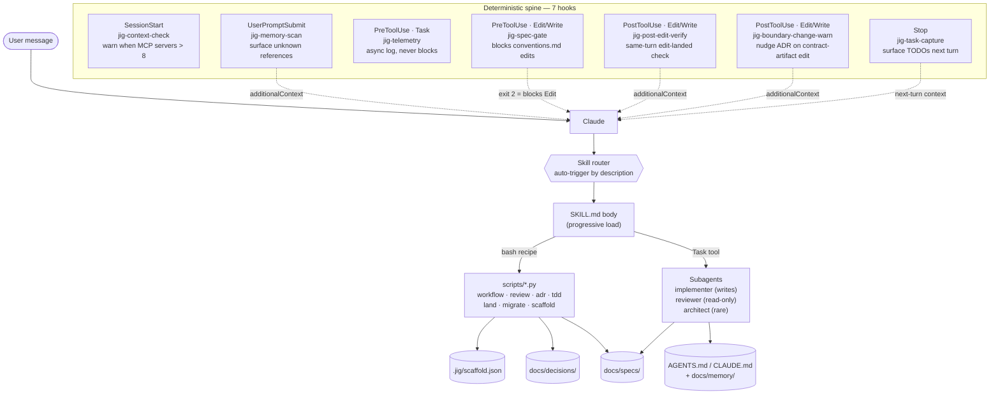

> Status: Draft (technical mechanics; vision and design principles live in [product-vision.md](product-vision.md))
>
> This document evolves as we make decisions. Open questions are explicit, not papered over.

# Architecture: jig

> For *what jig is*, *who it's for*, and *why it works the way it does*, see
> [product-vision.md](product-vision.md). This document covers the technical
> mechanics: source structure, host adapter boundary, hook spine, subagent
> roster, module boundaries, open architectural questions.

## Plugin structure

```
jig/
├── .claude-plugin/plugin.json     # Manifest
├── skills/                        # Claude Code skills (auto-trigger + /menu)
├── agents/                        # Subagent definitions (implementer, reviewer, architect)
├── hooks/                         # Deterministic enforcement layer
│   ├── hooks.json
│   └── scripts/                   # Python 3 scripts (no jq dependency)
├── templates/                     # Source templates scaffold-init reads
└── docs/                          # Dev docs for building jig itself (dogfooded)
```

This is still the canonical source tree. Claude plugin mode reads these
files directly from the installed plugin; Claude and Codex scaffold modes
materialize host-native copies into the target project. Future host
adapters should render from the same source rather than fork the workflow
model.

## Host support matrix

| Host | Distribution | Status | Notes |
|---|---|---|---|
| Claude Code | Plugin | v1 supported | Existing `.claude-plugin` package remains valid. |
| Claude Code | Scaffold | v1 supported | Existing `.claude/` scaffold output remains the default ownership model. |
| Codex | Scaffold | 033-05 implemented | Project-local output lives under `AGENTS.md` and `.codex/`. |
| Codex | Plugin | v2 deferred | Target packaging work lives in [slice 033-06](specs/033-host-adapter-portability/slice-06-codex-plugin-packaging.md); depends on successful Codex scaffold use. |
| Other harnesses | Any | out of scope | Future adapters need their own real user signal and spec slices. |

## Host adapter boundary

The architecture boundary is between jig's **logical workflow model**
and a host's **materialized runtime files**. Jig keeps one source for
skills, agent instructions, hook scripts, docs templates, and helper
code; each host adapter renders the files that a specific harness knows
how to load.

Every adapter must account for the same logical operations:

1. **Primer rendering.** Produce the project primer files the host reads
   at session start. New scaffolded projects use `AGENTS.md` as the
   canonical primer; Claude v1 keeps `CLAUDE.md` as the Claude Code adapter.
2. **Skill installation.** Copy or render jig skills into the host's
   project-scoped skill directory, rewriting helper paths only inside
   the adapter.
3. **Agent installation.** Render `implementer`, `reviewer`, and
   `architect` into the host's custom-agent format while preserving the
   intended capability shape.
4. **Hook installation.** Register the seven logical jig hooks against
   host-native lifecycle events.
5. **Hook protocol translation.** Convert jig-level results into the
   host protocol. The logical outcomes are `continue`,
   warning context, and blocking reasons; exit codes and JSON shapes are
   host-specific.
6. **Path/environment binding.** Bind project root and jig runtime root
   through host-neutral `JIG_*` conventions or self-location, with tiny
   host adapters translating from host-specific environment variables
   such as `CLAUDE_PLUGIN_ROOT`.
7. **Managed-file metadata.** Mark or manifest generated files so future
   update tooling can distinguish untouched jig-managed files from
   user-edited copies.
8. **Verification fixtures.** Provide stable generated-tree and hook
   protocol fixtures so adapter behavior can be tested without opening
   an interactive host session.

The implementation keeps Claude behavior in place while defining this
boundary. Codex scaffold generation now writes `.codex/` project-local
runtime files; `.codex-plugin/` packaging remains deferred to slice 033-06.

## Claude runtime wiring

How a session actually flows in Claude plugin-install mode. The LLM layer
(user → Claude → skill router → SKILL.md → helper or subagent → on-disk
state) is non-deterministic; the seven hooks form the deterministic spine
that fires on fixed events and can inject context or block tool calls.



- **Skill router** is a Claude Code internal — it auto-matches the user's message against every `SKILL.md` `description` field and loads the first match. Skills marked `disable-model-invocation: true` are skipped.
- **`bash recipe` arrow**: most `SKILL.md` bodies end with a deterministic bash block that calls the matching `.py` helper. Skills without a helper (`pr-review`, `arch-review`, `contracts`, `vision-elicitation`, plus the slice-to-spec workflow inside `migrate`) are judgment-only. `pr-review` and `arch-review` stay judgment-only as skills, but are *invoked* deterministically from the post-implementation flow via `review.py pr-review` / `review.py arch-review` prompt builders (see [skills/spec-workflow/SKILL.md](../skills/spec-workflow/SKILL.md) § "After implementation").
- **`Task tool` arrow**: `SKILL.md` can dispatch a fresh subagent via the `Task` tool. The three roles in `agents/` (`implementer`, `reviewer`, `architect`) are real `subagent_type` values when jig is installed as a plugin; outside the plugin they fall back to `general-purpose`.
- **Hook spine** intercepts at five Claude Code event types (SessionStart, UserPromptSubmit, PreToolUse, PostToolUse, Stop) via seven hook scripts. Two read-only (`telemetry`, `context-check`); four inject `additionalContext` (`memory-scan`, `task-capture`, `post-edit-verify`, `boundary-change-warn`); one can block tool calls with exit-code 2 (`spec-gate`). At the host-adapter boundary these are logical `warn` or `block` hooks; the Claude adapter supplies the current event names, JSON shape, and exit-code behavior.

Scaffold-mode wiring is identical in shape — only path strings differ
(`${CLAUDE_PROJECT_DIR}/.claude/...` instead of `${CLAUDE_PLUGIN_ROOT}/...`).
See the **Claude dual-distribution** decision below for the rewrite
details.

## Core architecture decisions

### Hooks are the deterministic spine; skills are the LLM layer
*Principle:* see [product-vision.md § Design principles](product-vision.md#design-principles) (#1).
*Mechanics:* hook entries live in `hooks/hooks.json` and run unconditionally on their declared event; skill entries live in `skills/<name>/SKILL.md` and auto-trigger via description matching against user messages.

### Hook scripts: Python 3, never jq
`jq` is not installed by default on macOS. All hook scripts use inline `python3 -c` for JSON parsing. Python 3 is reliably available.

### Hook command paths: `${CLAUDE_PLUGIN_ROOT}/hooks/scripts/...`
Plugin `bin/` PATH injection is Bash-tool only, not hook commands. All hook `command` fields use the full `${CLAUDE_PLUGIN_ROOT}` path.

### Claude dual-distribution: plugin install AND scaffolded install
*Principle:* [product-vision.md § Design principles](product-vision.md#design-principles) (#7) — dev owns the scaffolding, not the plugin runtime.

As of [spec 016-scaffold-mode](specs/016-scaffold-mode/spec.md) (slices
016-01 + 016-02 + 016-03 all DONE; 016-04 deferred), `scaffold-init` copies the
runtime machinery (`skills/`, `agents/`, `hooks/scripts/`) into the
user's `.claude/` directory under `jig-` prefixed names
(`.claude/skills/jig-<name>/`, `.claude/agents/jig-<name>.md`,
`.claude/hooks/scripts/jig-*.sh`), and generate/merge
`.claude/settings.json` to register the seven jig hooks against the
project-local script paths. SKILL.md path strings are rewritten from
`${CLAUDE_PLUGIN_ROOT}/skills/<name>/` to
`${CLAUDE_PROJECT_DIR}/.claude/skills/jig-<name>/`, and hook command
paths from `${CLAUDE_PLUGIN_ROOT}/hooks/scripts/` to
`${CLAUDE_PROJECT_DIR}/.claude/hooks/scripts/`, both at copy time.

The settings.json merge follows an **append-with-marker** strategy
(slice 016-02): every jig-managed hook entry carries
`metadata: {managed_by_jig: true}`. Pre-existing non-hook top-level
fields (`permissions`, `env`, etc.) pass through verbatim;
pre-existing non-jig hooks survive; jig entries replace in place on
re-run (idempotent). A safety check (`UnmanagedHooksError`, exit 3)
refuses to write when the existing settings.json has hooks but none
carry the jig marker — `--force` is the documented escape.

The plugin distribution (zip + marketplace) is unchanged; the source
SKILL.md files and `hooks/hooks.json` keep their `${CLAUDE_PLUGIN_ROOT}`
paths. Only the scaffold path rewrites. Coexistence between scaffolded
and plugin installs falls under Claude Code's normal
project-scoped-wins precedence; jig introduces no new arbiter.

### Context economy (the "dumb zone")
*Principle:* see [product-vision.md § Design principles](product-vision.md#design-principles) (#2).
*Mechanics:* the `jig-context-check` hook warns at session start when fill approaches the ~40% threshold. Skills use progressive disclosure — body loads only on trigger; supporting files load only when referenced.

### Three subagents, no more
*Principle:* see [product-vision.md § Design principles](product-vision.md#design-principles) (#3) — subagents are defined by what context they need isolated from, not by job title.

*Roster:*
- `implementer`: TDD discipline, writes deliverables
- `reviewer`: read-only, fresh context per review. Fires 1–3 times per slice under the multi-perspective post-implementation flow: once for compliance, once for craft (`pr-review`), and once for arch (`arch-review`) when the slice's frontmatter declares `arch_review: true`. Reused as the agent shape for all three passes — no `pr-reviewer` or `arch-reviewer` agent.
- `architect`: rare, ADR-style output

As of [spec 011-01 (plugin-self-install)](specs/011-plugin-self-install/spec.md),
all three are reachable as real `subagent_type` values when jig is installed
as a Claude Code plugin (the bundled `jig` marketplace — renamed from
`jig-dev` in slice 013-04 — or any future public install). Pre-spec-011, every caller fell back to
`subagent_type: "general-purpose"`. Slice 011-02 added
`review.py subagent-type` so SKILL.md's bash recipe picks the real
`reviewer` deterministically when installed and degrades to
`general-purpose` when running from source.

## Module boundaries

Six top-level concerns, named in [product-vision.md § Core features](product-vision.md#core-features-prioritized) at the vision layer:

- `skills/` — auto-triggering LLM behaviors (one `SKILL.md` + supporting files per skill)
- `agents/` — three subagent definitions (`implementer` / `reviewer` / `architect`)
- `hooks/` — deterministic spine (`hooks.json` + Python 3 scripts under `hooks/scripts/`)
- `templates/` — source templates that `scaffold-init` copies into new projects (`AGENTS.md`, `CLAUDE.md`, docs/, brief)
- `scripts/` — Python helpers invoked by skills, one per skill where the work is mechanical: `workflow.py`, `review.py`, `adr.py`, `tdd.py`, `land.py`, `migrate.py`, `scaffold.py`
- `.claude-plugin/` — plugin manifest (`plugin.json`) + marketplace descriptor (`marketplace.json`)

The host adapter boundary sits inside the scaffold/runtime-rendering
concern: shared helper logic stays source-centralized, while host
renderers own path rewrites, primer choice, agent format, hook
registration, and hook protocol translation.
`skills/scaffold-init/scaffold.py` currently exposes this boundary as a
host-neutral `HostRenderer` interface plus concrete renderers for Claude
(`ClaudeScaffoldRenderer`) and Codex (`CodexScaffoldRenderer`). Claude
scaffold mode writes `AGENTS.md`, `CLAUDE.md`, `.claude/skills/`,
`.claude/agents/`, `.claude/hooks/scripts/`, and `.claude/settings.json`.
Codex scaffold mode writes `AGENTS.md`, `.codex/skills/`,
`.codex/agents/*.md`, `.codex/hooks/scripts/`, `.codex/templates/`, and
`.codex/hooks.json` without producing Claude-only files. The templates copy
is runtime support for scaffolded helpers whose source fallback resolves
template paths relative to the materialized jig runtime. Codex also installs
non-discoverable unprefixed helper aliases under `.codex/skills/<name>/`
without `SKILL.md`; these preserve existing peer-helper imports such as
`skills/scaffold-init/scaffold.py` without registering duplicate skills.
Current Codex agent files are Markdown prompts with an explicit capability
note because Codex cannot enforce the same per-agent tool isolation encoded
in Claude frontmatter.

## Managed-File Metadata Policy

Scaffolded files are tracked with a **manifest-only** default: `scaffold.json`
records each managed file's relative path, source template/path, jig version,
host renderer, and `sha256` content hash. This keeps large prompt/prose files
such as `AGENTS.md`, `CLAUDE.md`, `docs/**`, skill `SKILL.md` bodies, and
agent prompts readable for LLMs instead of adding noisy per-file metadata
banners.

Inline markers are reserved for native host merge safety when the host file is
itself a structured merge surface. Today that means Claude hook entries inside
`.claude/settings.json` carry `metadata: {managed_by_jig: true}` so jig can
replace its own hook registrations without clobbering user-owned hooks. The
file-level source/hash record for `.claude/settings.json` still lives in
`scaffold.json`. Codex hook registration is generated as a whole
`.codex/hooks.json` file with top-level `metadata: {managed_by_jig: true}`;
scaffold refuses to overwrite an existing unmarked Codex hook config unless
the user passes `--force`.

On a force re-run, scaffold checks manifest hashes before writing. Untouched
managed files may be regenerated; edited managed files cause a clear refusal
so the user can move or merge their change first. Missing managed files may be
regenerated. `scaffold.json` is the completion sentinel and manifest root, so
it is not self-hashed.

Interface contracts between the other modules are deliberately deferred
— today's coupling is read-only and one-directional (skills read
templates; helpers read specs; hooks read events; nothing writes across
the module boundary). Will tighten when the first bidirectional case
appears.

## Data model

Jig is a workflow layer, not a data application (per [product-vision.md](product-vision.md) non-goals). Relevant on-disk state is small:

- `scaffold.json` — install manifest: which tiers chosen, when, by which jig version, plus managed-file metadata for scaffolded output (per [ADR-0001](decisions/adr-0001-scaffold-stable.md))
- `.jig/skill-usage.jsonl` — telemetry append-only log (deferred until a real consumer exists)
- `docs/specs/**/spec.md` — the only project-level state jig owns; everything else lives in the dev's repo, owned by the dev

## Contract surfaces

<!-- elicited: 2026-05-15 / status: skipped -->

_Skipped: jig does not currently expose schema-shaped external interfaces. Its current external surfaces are host skill metadata such as SKILL.md frontmatter (consumed by Claude Code in v1), host hook configuration, and CLI argparse interfaces on the `.py` helpers (consumed by humans + scripts). None warrants an OpenAPI / JSON Schema / AsyncAPI / `.proto` / GraphQL SDL artifact. If jig later grows an HTTP / events / RPC surface (e.g. a telemetry sink endpoint, a remote-spec-status query API), this section gets filled per the `/jig:contracts` skill's per-surface recommendation table._

_Self-coherence note (spec 022-02): this slot exists so the `/jig:independent-review` reviewer-prompt's conditional contract-surface check stays quiet on jig's own slice reviews — the `status: skipped` marker + the no-bullet body together signal "no surfaces to check" to the detector. See [skills/contracts/SKILL.md](../skills/contracts/SKILL.md) for the per-surface recommendation table the elicitation references._

## Open questions

- `SubagentStart` hook event: documented in changelog (v2.0.43) but absent from official plugin docs. Deferred — see `docs/refinement-todo.md`.
- Hook strictness profiles (`SCAFFOLD_HOOK_PROFILE`): deferred — unread env var is worse than no env var.
- Does the `additionalContext` format differ between `UserPromptSubmit` and `Stop` hooks? Verify during implementation of 002-03.
