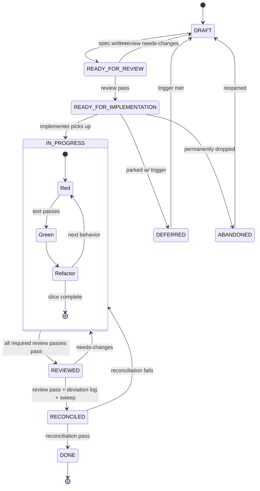
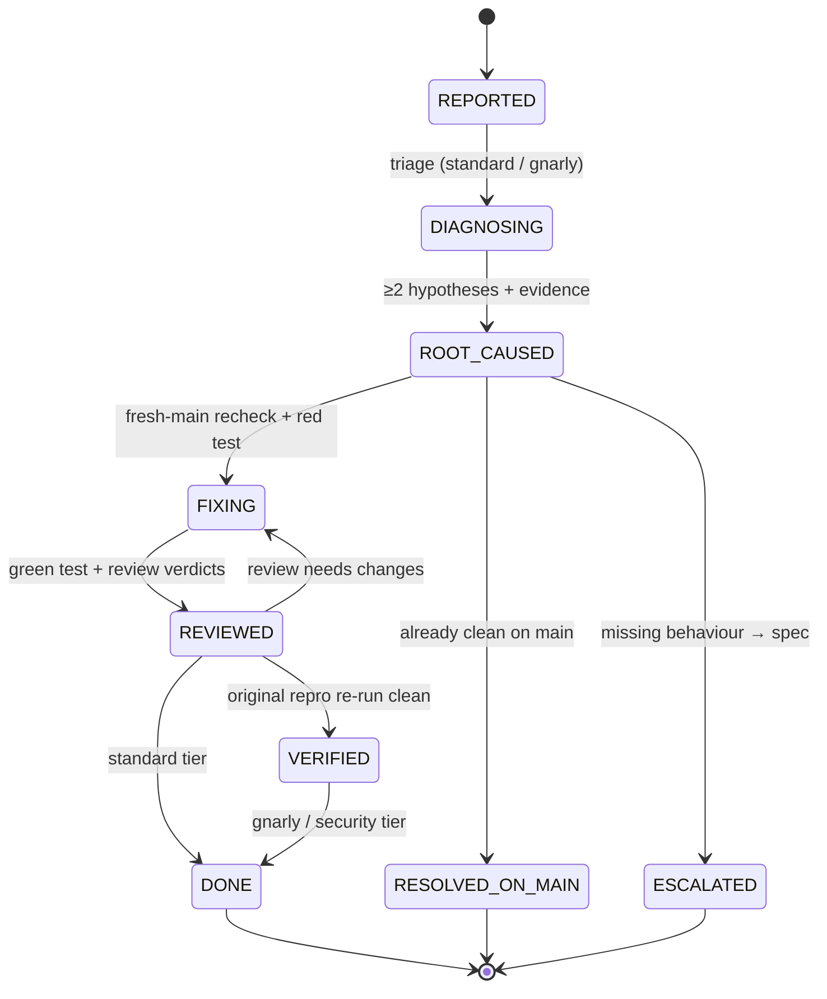

> Status: Stable

# Workflow: jig

## How we build jig

We use the workflow jig is designed to produce — dogfooding from day one.

## Working posture — recorded decisions are context, not ammunition

The scaffold primer states the standing posture ([ADR-0056](decisions/adr-0056-adversarial-register-quarantine.md)):
adversarial review is a *named, bounded operation*; outside it, default to
collaborative and solution-forward. This section elaborates the part most prone
to leak: **how the recorded corpus is used in ordinary conversation.**

A recorded decision (an ADR, a spec, a closed record) is context to **reconcile
against**, not ammunition to **refuse with**. When a user's idea appears to
conflict with a record, *surface and explore* it — say what the record holds and
work the question — rather than building a blocking case out of the corpus.

The failure mode to name explicitly is **reconcile-then-block**: engaging the
records and then leading with a why-not the user never asked for. Reconciling is
not the problem; *carrying a blocking intent into a question that asked for none*
is. Answer the question that was actually asked; a recorded decision is a reason
to *inform*, not a reason to *refuse*. (The [`reframe`](../skills/reframe/SKILL.md)
skill already names this defend-the-record tendency as jig's structural blind
spot.)

**One hard exception — the spec 102 amendment guardrail stays hard.** Amending a
closed **record** without owner approval is genuinely gated (see the
[reconciliation checklist](#reconciliation-rules)); its "surface the conflict and
stop" brake is a deliberate, prose-only safety stop and is **not** softened by
this collaborative default. The default above governs *exploratory conversation*
about the corpus — never the unauthorized-record-amendment case.

## Host packages (`hosts/`) — regenerate, never hand-edit

The repository root is canonical source; the committed `hosts/claude/` and
`hosts/codex/` trees are **generated** runtime install payloads. They are
checked in so a remote `marketplace add` resolves a clean package, but they are
derived artifacts — never hand-edit a file under `hosts/`.

The loop when you change source (a skill, hook, agent, manifest, template — or
bump a version in a `*-plugin/plugin.json` manifest):

1. **Edit source** at the repo root (not under `hosts/`).
2. **Regenerate both packages:** `python3 scripts/build_host_packages.py`
3. **Commit `hosts/`** alongside the source change (`git add hosts/`).

CI runs the **drift guard** (`python3 scripts/build_host_packages.py --check`)
on every PR: it regenerates into a scratch dir and diffs against the committed
`hosts/` tree, failing — and naming the stale path plus the regenerate command
— when source was edited without rebuilding. So a forgotten rebuild (including a
release version bump that must reflect into both packages) cannot merge
silently.

## Routing: spec-shaped vs bug-shaped work

Before reaching for the spec lifecycle, decide which lifecycle the work
actually wants. jig has two first-class workflows, each proportional to a
different shape of work, plus the no-ceremony floor:

- **Bug-shaped work** — a reported defect: existing behaviour is wrong, and
  the job is to *diagnose the root cause, prove it, prevent regression*. This
  goes through **`jig:bug-fix`**, proportional to tier: a trivial bug (typo,
  one-liner, mechanical) is bowed out — write the failing test with
  `tdd-loop`, fix, and commit, no record — while standard and gnarly bugs get
  the durable record and the diagnose-and-regression gates. See
  [Bug lifecycle](#bug-lifecycle) below.
- **Spec-shaped work** — a hard-to-reverse decision, a cross-layer change, or
  new/ambiguous-scope behaviour: the job is to *specify intended behaviour and
  split it into vertical slices*. This goes through **`spec-workflow`**. When a
  bug turns out to be a *missing* behaviour rather than a defect, the bug-fix
  workflow escalates it into a spec instead of grinding it through the bug
  gates. See [Spec lifecycle](#spec-lifecycle) below.
- **Trivial work** — a one-liner with no decision and no design — skips both
  workflows: `tdd-loop` + commit.

A **pure visual design-fidelity gap** — the screen works but hasn't reached its
agreed mockup — is **spec-shaped, not a bug** ([ADR-0049](decisions/adr-0049-design-fidelity-routing-to-originating-spec.md)):
it routes to the spec spine (the originating spec when one exists, a new spec
with the mockup as design-value ACs when it doesn't), never `jig:bug-fix`. A
design issue is bug-shaped only when the UI *malfunctions*. See bug-fix's
"Design-fidelity triage" for the full test.

Each shape has a first-class home: bug-shaped work is not routed to a skill
that doesn't exist, and spec-shaped work is not dressed up as a bug. Both
lifecycles are mapped below; their operational contracts — every command,
gate, and field — live in
[spec-workflow/SKILL.md](../skills/spec-workflow/SKILL.md) and
[bug-fix/SKILL.md](../skills/bug-fix/SKILL.md).

## Spec lifecycle

Every non-trivial piece of work gets a spec in `docs/specs/NNN-name/`. The
lifecycle is a forward path with three review-driven back-edges and two
parked/dropped sidetracks (`DEFERRED` — resumable; `ABANDONED` — permanent,
pre-DONE only), with TDD's red→green→refactor cycle nested inside
`IN_PROGRESS`:

Each forward transition is a checkpoint; each back-edge is a reasoning loop
(spec review, implementation review, reconciliation review, TDD). The
review-driven checkpoints are not honour-system prose: `workflow.py
transition` **refuses** the `REVIEWED` / `RECONCILED` / `DONE` moves unless
the required review evidence exists and passes (see
[Post-implementation review](#post-implementation-review) and
[Reconciliation rules](#reconciliation-rules) below). No `Stop` hook is
involved — the task-capture `Stop` hook is a nudge that blocks nothing; the
deterministic gate lives in the transition helper. State names match
`VALID_STATUSES` in
[skills/spec-workflow/workflow.py](../skills/spec-workflow/workflow.py).

**Slice ownership (claim-on-working-state).** The lifecycle splits two ways
for ownership purposes:

- **Working states** — `READY_FOR_REVIEW`, `IN_PROGRESS`, `REVIEWED`,
  `RECONCILED`. A session is doing something here, so transitioning into one
  **stamps** `claimed_by:` (current branch name, or `JIG_CLAIM_ID`). This is
  what covers spec-level work — spec review, frame-critique, and above all
  `REVIEWED → RECONCILED` reconciliation, which was previously unmarked.
- **Release points** — the two *pickup-queue* states `DRAFT` and
  `READY_FOR_IMPLEMENTATION`, plus the three terminal states `DONE` /
  `DEFERRED` / `ABANDONED`. Entering one **clears** the claim. `--release
  --reason "<why>"` force-clears anywhere and logs to `## Release log`.

The queue-state exclusion is deliberate: `DRAFT` and
`READY_FOR_IMPLEMENTATION` are exactly the states the pickup flow tells a reader
to choose from, so a residual owner there would mark a *free* slice as occupied
— inverting the defect this exclusion is meant to fix.

The claim is **local by default**; `--push` (or `--pr`) reserves it on
`origin/main` so other worktrees see it, at any working state rather than only
at start-of-build. Only an `IN_PROGRESS` reservation also publishes `status:` to
the trunk copy — that write is what the start-collision guard reads; every other
working state publishes the claim alone, because trunk lifecycle state belongs
to the landing flow, not to a feature branch's in-flight transitions.

Four levels of notice, deliberately different:
- **Hard refusal** — only when a foreign claim holds a slice that is *already*
  `IN_PROGRESS` and you are transitioning it to `IN_PROGRESS`, locally or on
  `origin/main`. Two sessions building one slice is the unrecoverable case.
- **Warning, non-blocking** — any other foreign claim on your own copy, and a
  foreign `origin/main` claim at a **working** status. Two sessions working one
  spec can be legitimate, so this names the holder and proceeds. A foreign trunk
  claim sitting at a *queue* status is deliberately silent: the slice is free
  there, so a leftover name is residue, not presence. The *replace* notice is deduplicated by
  identifier against the on-disk one, so a single transition does not report the
  same holder twice for the same reason.
- **Reservation declined** — `--push`/`--pr` at a working state *other than*
  `IN_PROGRESS` is **best-effort**. If the `origin/main` copy sits at
  `status: IN_PROGRESS` under someone else's claim, or under none, the
  reservation warns and pushes **nothing**, then exits 0. That state is
  *enforced* (it is what the start-of-build guard hard-blocks on), so stamping a
  claim over it would either move a live lock and get the previous owner refused
  in your name, or — on an unclaimed copy — manufacture the enforced pair from
  the other direction and refuse everyone. There is no self-service fix for a
  trunk-side claim — `--release` clears only your own copy — so coordinate with
  the holder or wait for their work to land. Your **own** trunk claim is
  unaffected: that reports a benign no-op.
- **Silence** — the routine paths: your own claim, and any slice whose claim was
  released into the pickup queue.

**What a claim does NOT tell you.** A claim names *the session that last moved
this slice into a working state*, which is a presence hint rather than a live
lock: the stamp fires on entry, so a session that picks up a slice someone else
transitioned will not appear until its own next transition.

**Both directions are soft.** An empty `claimed_by:` on a working-state slice is
*no claim recorded*, **not** evidence the slice is free: claims are local unless
pushed, so a parallel worktree's unpushed claim is invisible, and a plain
`Edit`-tool write never takes a claim at all. A *non-empty* one is **not** proof
anyone is still there either: a claim transfers to whoever transitions next, and
one can survive a merge naming a branch that no longer exists. Treat a blank
owner as "unknown" rather than "available" — reading it as "available" is exactly
the failure mode this claim model exists to prevent — and treat a stale-looking
owner as worth a question, not a blocker.

**Worktree baseline and post-land sync.** Reservations from `workflow.py new`
and `--push` slice claims land on `origin/main`; that remote ref remains the
authority for reservation and landing correctness. `slice-land execute --mode
direct` performs the final local housekeeping step after a successful
authoritative push: it fast-forwards the canonical local worktree checked out
at `refs/heads/main` to `origin/main`, or prints `local main sync skipped:
<reason>` when that worktree is missing, dirty, locked, diverged, or otherwise
unavailable. PR-shaped landings report local sync as pending until the PR
merges. For worktree-heavy sessions, `worktree.baseRef: "fresh"` in
`~/.claude/settings.json` still keeps new Claude Code worktrees forked from
`origin/HEAD` rather than any stale local `main`. Mechanism, verification, and
fallback: [memory/learnings.md](memory/learnings.md) → "Worktrees fork off
stale local `main`".

## Bug lifecycle

Reported defects run through their own lifecycle — a peer of the spec lifecycle
above, not a lightweight offshoot of it. `jig:bug-fix` owns it, and the
operational contract lives in
[bug-fix/SKILL.md](../skills/bug-fix/SKILL.md); this section is the onboarding
map.

The forward path diagnoses the root cause, proves it with a witnessed
red→green test, reviews the fix, and closes with a recorded learning. Two
terminal off-ramps branch off it: a "bug" that turns out to be a *missing*
behaviour escalates to a spec, and a bug already fixed on trunk closes as
resolved-on-main rather than generating a duplicate patch.

Proportionality is enforced *downward* — the workflow refuses to build ceremony
for a one-liner. Triage is the de-escalation gate, not an escalation ramp:

| Tier | What it gets |
|---|---|
| **trivial** (typo, one-liner, mechanical) | No record. Triage bows out to `tdd-loop` + commit. |
| **standard** | A durable `docs/bugs/NNN-slug.md` record, the diagnose gate, the red→green teeth, and bug-review + craft passes. Closes `REVIEWED → DONE`. |
| **gnarly** (cross-layer, security, regression-that-didn't-stick, design-gap) | Full rigor: mandatory ≥2 hypotheses, the extra `VERIFIED` step, a conditional security pass, and a trunk-reserved number. May escalate to a spec. |

Three gates give the lifecycle its teeth. Each checks presence and shape, never
quality — quality stays the reviewer's job:

- **Diagnose gate** (`→ ROOT_CAUSED`) — at least two candidate hypotheses with a
  marked leading one and an evidence pointer, so the first explanation is never
  taken as the last word.
- **Fresh-main recheck** (`ROOT_CAUSED → FIXING`) — the original repro is re-run
  against fresh `origin/main` before any fix is written. If it is already clean
  there, the bug closes as `RESOLVED_ON_MAIN` instead of duplicating a landed
  fix.
- **Red→green teeth** (`→ FIXING`, then `→ REVIEWED`) — the helper witnesses the
  regression test fail before the fix and pass after, so "there is a regression
  test" is machine-attested rather than claimed.

Like every jig gate, each is a *deliberateness* mechanism — bypassable as an
explicit out-of-band act, not a hard human-only wall.

## Host phase modes

Jig uses a small host-neutral phase vocabulary so Claude, Codex, and future
host adapters can describe the same workflow in their own native UI terms:

| Phase | Meaning in jig |
|---|---|
| `plan` | Clarify the request, draft or revise specs and ADRs, split slices, and produce the session plan before source edits begin. |
| `implement` | Execute one accepted slice against its acceptance criteria, including tests and code/docs changes. |
| `review` | Run the required read-only compliance, craft, and optional specialist passes after the deliverable is on disk. |
| `reconcile` | Record deviations, update drift-prone docs, run the reconciliation review, and prepare the slice for closure. |
| `land` | Commit, merge or open the PR, regenerate the status board, and sync memory after gates pass. |

Host-native modes are advisory affordances, not lifecycle state. Codex Plan
mode, Claude Code plan mode, edit/accept modes, and similar host controls can
make the phase rhythm clearer, but they never satisfy a jig transition, review,
or approval requirement by themselves. The durable record remains the spec,
slice frontmatter, ADRs, status board, deviation log, and review evidence.

## SPIDR splitting

All specs are SPIDR-split before implementation begins:

- **S — Spike**: last resort, not first. Only when none of P/I/D/R apply.
- **P — Path**: split by alternative paths through the story (happy path first).
- **I — Interface**: split by UI / platform / channel (minimal first, polish later).
- **D — Data**: split by data subset (less data first).
- **R — Rules**: split by business rules (simple first, edge cases later).

**Anti-horizontal-phasing guardrail**: every slice must touch the user-facing layer and deliver end-to-end value. A slice that only touches the DB is horizontal phasing.

## Session workflow

1. Read the automatic `jig hint:` orientation injected at `SessionStart`, or run
   `python3 skills/spec-workflow/workflow.py orient --project-dir .` to refresh it.
   Architecture/spec artifacts outrank shallow source-tree inference about whether
   the project is greenfield or decisions are absent.
2. Check `docs/specs/README.md` and `docs/bugs/README.md`; route feedback/triage defects to `bug-fix` before drafting spec ACs.
3. Pick up the focused or next `READY_FOR_IMPLEMENTATION` spec slice.
4. Spawn the `implementer` subagent with the spec path.
5. After the deliverable is on disk, run the post-implementation review (see "Post-implementation review" below — up to four passes via `jig:independent-review`, `pr-review`, and optionally `arch-review` (`arch_review: true`) + `jig:code-health` (`code_health_review: true`)).
6. Address reviewer findings; `[blocker]`-tagged craft/arch/code-health findings block the REVIEWED transition; `[nit]`-tagged ones become reconciliation-log items.
7. Run reconciliation: update `architecture.md` if module boundaries changed; annotate spec with deviation log and reconciliation sweep; run + `record-review` the reconciliation review, then `workflow.py transition … RECONCILED` (gated on that evidence + the deviation log + the sweep).
8. `workflow.py transition … DONE` (re-validates the full review-evidence set + dependencies). Update `docs/specs/README.md`.
9. Run `memory-sync` to consolidate learnings.

## Post-implementation review

Every slice goes through up to four review passes between IN_PROGRESS
and REVIEWED — two always-on, two gated on slice frontmatter flags.

1. **Compliance pass — `jig:independent-review`** (always). A reviewer
   subagent with a fresh, self-contained prompt and read-only tools
   evaluates the deliverable against the slice's acceptance criteria.
   The prompt embeds a deterministic test-quality snapshot — `quality.py`
   reads the slice's merge-base-to-HEAD diff and reports `per-file-flood` /
   `assertion-thin` / `mock-heavy` signals — so findings can cite a
   fired signal by name. Verdict envelope: VERDICT / REASONING /
   SPECIFIC ISSUES / RECONCILIATION NOTES. `fail` or `needs-changes`
   blocks the transition.
2. **Craft pass — `pr-review`** (always). The reviewer subagent is
   read-only (Read/Glob/Grep, **no `Skill` tool**), so it cannot route to
   a skill via Claude's skill router. Instead `review.py` detects a
   user-installed `pr-review` skill on disk (`~/.claude/skills/pr-review/`)
   and points the reviewer at that concrete path to read-and-apply; absent
   one, it inlines jig's baseline buckets. (This file-read dispatch is what
   makes the pass work on a subagent that has no `Skill` tool: a prose
   skill-router instruction would be inert there.) Output: scope / blockers /
   nits / strengths, wrapped in the same verdict envelope; SPECIFIC ISSUES entries
   tagged `[blocker]` / `[nit]` / `[strength]`. Only `[blocker]`-tagged
   entries block; `[nit]` and `needs-changes` become reconciliation-log
   items.
3. **Arch pass — `arch-review`** (on-demand). Runs only when the
   slice's frontmatter declares `arch_review: true`. Same file-read
   dispatch (`~/.claude/skills/arch-review/`, else jig's baseline).
   Output: summary / strengths / concerns / open questions. Same block
   rule as the craft pass.
4. **Code-health pass — `jig:code-health`** (on-demand, **gated** by
   `code_health_review: true`). The orchestrator runs `health.py` and feeds
   its **tight summary** into `review.py code-health … --summary-file`; the
   read-only reviewer (no Bash) judges that summary — never raw logs, never
   runs the tool itself. It renders the judgment a tool can't: is the
   duplication within the inline-mirror budget? is the complexity inherent or
   fixable? are the lint findings worth blocking on? Same `[blocker]`/`[nit]`
   block rule as the craft pass. It is gated rather than always-on because the
   per-slice review carries a real context cost; it defaults off.

Order: compliance → craft → (arch if `arch_review: true`) → (code-health
if `code_health_review: true`). All required passes must `pass` for the
IN_PROGRESS → REVIEWED transition.

The reviewer's isolation is prompt- and tool-scoped — a self-contained
prompt plus read-only tools — not a hard sandbox (parent context is
technically reachable; see `skills/independent-review/SKILL.md`
§ Context isolation pattern). It works reliably when the prompt is sharp.

### Recording verdict evidence (the gate's input)

Each pass produces a **durable verdict artifact**, not ephemeral chat.
After a pass returns, record its verdict with `review.py record-review`,
which writes `docs/specs/NNN-slug/reviews/slice-NN-<pass>.md`
(`<pass>` ∈ `compliance` / `craft` / `arch` / `code-health` /
`reconciliation`; the schema lives in
`skills/_common/review_evidence.py`). The end-to-end enforced path is:

1. **Build the prompt** — `review.py implementation|pr-review|arch-review`
   (compliance / craft / arch) builds the reviewer prompt; Claude spawns
   the reviewer subagent.
2. **Record the verdict** — `review.py record-review … --pass <pass>
   --verdict pass|fail|needs-changes --summary-file <path> …` writes the
   artifact beside the slice it grades. The freeform body is required:
   pass a file, or `--summary-file -` to pipe it in. stdin is never read
   implicitly — the body path is always explicit.
3. **Run the gated transition** — `workflow.py transition <spec.md>
   <slice> REVIEWED`. The helper imports the same validator and **refuses**
   the move unless `compliance` + `craft` (+ `arch` when the slice
   declares `arch_review: true`, + `code-health` when it declares
   `code_health_review: true`) all exist and carry `verdict: pass`. A
   refusal names the missing/invalid artifact and the `record-review`
   command to produce it. (`review.py check-reviews … --stage REVIEWED`
   runs the same check ahead of the transition.)

The gate enforces **evidence consistency**, not human sign-off — it lives
inside the agent's trust boundary, so it is a *deliberateness* mechanism, not
human-only enforcement, the same framing as the conventions gate. A deliberate
out-of-band flow can bypass it with `JIG_REVIEW_EVIDENCE_GATE=0` (also
`false`/`off`/`no`); the status still transitions and the `DONE` dependency
check still runs — only the evidence check is skipped. The auto-tick of the two
review-passed DoD boxes still happens, but now **after** the gate clears, so a
ticked box always has passing evidence behind it.

Review/reconcile test failures are only evidence about the checked-out base.
Before recording a failure as "pre-existing on main", fetch `origin/main` and
verify that the current branch contains it (or merge/rebase and re-run). The
helpers surface a soft warning when `HEAD..origin/main` is non-empty, because a
stale base can make already-fixed failures look like current `main` failures.

### Recovering from a failed review

A `fail` or `needs-changes` verdict blocks the `REVIEWED` transition (and a
`[blocker]`-tagged craft/arch finding likewise — it is recorded as a
non-`pass` verdict). To recover:

1. Address the reviewer's findings (adding regression tests for any real
   bug found).
2. Re-run the review pass against the updated deliverable.
3. `record-review` the new verdict — it **overwrites in place** the earlier
   file for that `(slice, pass)`, so the latest verdict is operative and
   git history keeps the prior one.
4. Re-run `workflow.py transition … REVIEWED`. With every required pass now
   `pass`, the gate clears. A non-`pass` artifact that was never overwritten
   by a later `pass` keeps blocking — that is exactly the "superseded
   without a later pass" case the gate is meant to catch.

## Reconciliation rules

After implementation, before marking DONE:

- Update specs with deviation log annotations (original ACs preserved).
- **Lightweight decisions** — did this session's review or implementation settle
  any non-spec decisions (UI strings, visual choices, translation corrections,
  scoped brand/icon calls)? If yes, record them in
  `docs/decisions/lightweight-decisions.md`. (Not a gate — a checklist nudge.)
- Update `architecture.md` ONLY if module boundaries or contracts changed (signal: write an ADR).
- **Load-bearing decision (ADR trigger, judgment — not just a boundary change).**
  A load-bearing design choice with rejected alternatives — one a future agent would need to know about to avoid undoing it — warrants an ADR even when it changes no module boundary or public contract.
- **Re-ask that question when a recorded decision is REVISED.** Routing is asked
  once at first write and never again, so a decision re-priced by review can stay
  misfiled indefinitely. If a revised entry now clears the trigger above, promote
  it — `decisions.py promote --title "<title>" --no-push` — rather than editing it
  in place; if it is still settled, local and bounded, revise with `decisions.py
  update`. Never hand-edit `lightweight-decisions.md`. (`--no-push` because you are
  on a branch: push mode reserves the ADR on `origin/main` from an ephemeral
  worktree, so it never reaches your working copy — `promote` refuses off `main`
  rather than stranding one there.)
- ADRs are immutable after acceptance — new decisions supersede, never edit.
- Closed records (DONE / SUPERSEDED specs and slices) preserve drift via a
  `## Amendments` section; run `python3 skills/spec-workflow/workflow.py
  amendments` for a read-only digest of the current overrides so you don't have
  to reread each historical block to find effective state.
- `docs/conventions.md` changes require explicit human approval. The
  `jig-spec-gate` hook backstops this rule — but it is a *deliberateness*
  gate that catches accidental side-effect edits, not a hard human-only
  guarantee (the env var is satisfiable by any shell, including the agent's).
  Where a team needs mechanical human-only enforcement, use an out-of-band
  channel — `CODEOWNERS` on the file, a CI check on the PR diff, or branch
  protection.
- A second reviewer pass runs on the reconciliation itself. Record its
  verdict with `review.py record-review … --pass reconciliation`, then
  `workflow.py transition <spec.md> <slice> RECONCILED`. That move is
  **gated**: it refuses unless the `reconciliation` verdict
  is recorded and `pass` **and** `### Deviation log` plus
  `### Reconciliation sweep` subsections are present under the slice heading
  (the reviewer attests the content; the gate only checks the headings are
  there).
- Write a `### Reconciliation sweep` beside the deviation log before moving to
  `RECONCILED`. The sweep is a manifest of drift-prone surfaces checked during
  reconciliation: front-door docs, architecture/product docs, primer surfaces
  (`CLAUDE.md`, `AGENTS.md`, scaffold templates), inbox/refinement queues,
  memory, ADR indexes, and any other live prose the slice affected. Use
  `updated` when the surface changed, `no-op` when it was checked and still
  matches reality, and `deferred` when cleanup remains; deferred rows name an
  owner or trigger. Live prose stays inline-correct; closed records preserve
  corrections in amendments.
- `transition … DONE` re-validates the post-implementation set —
  `compliance` + `craft` (+ any REVIEWED-stage gated passes such as `arch`,
  `code-health`, or `design-review`) + `reconciliation` — plus the deviation log and
  reconciliation sweep, on top of the existing `dependencies:` check, so a
  hand-edited status can't walk past a gate an earlier transition enforced.

## Context-cost discipline

**The orchestrator's context is the most expensive real estate in the
system.** It is re-read on every turn for the whole session, so its cost is
roughly *context-size × number-of-turns*. Measured on jig's own development:
~90% of cost is the orchestrator (subagents ~8%), ~97% of token *volume* is
`cache_read` — the main session re-reading its accumulated context — and the
always-loaded primer (CLAUDE.md + `docs/memory/*`) is only ~4% of a heavy
session's reads. The lesson: the baseline is cheap; **in-session growth** is
the cost. Keep the orchestrator lean — every token that enters it is paid for
again on every subsequent turn.

This is a *cost* argument that lands on the same place as the "dumb zone"
*quality* argument (>40% context fill degrades recall): both say keep the
orchestrator lean.

### Run thin — dispatch and integrate, don't do the work yourself

**Rule:** when picking up a spec, plan the delegation up front and then run
the orchestrator as a thin *dispatch-and-integrate* loop. The cross-session
deep-dive confirmed the dominant cost driver is **turn count**: because the
orchestrator re-reads its full context on every turn, cost is roughly
*context-size × turns*, and turn count correlates with cost-equivalent spend at
r = 0.92. The plannable lever is to **front-load the delegation
decisions** so the orchestrator dispatches against a plan rather than
improvising work across many turns.

- **Get the plan deterministically.** `python3 skills/spec-workflow/workflow.py
  session-plan <spec.md>` enumerates the spec's non-DEFERRED, non-ABANDONED
  slices and prints,
  per slice, the standard phase sequence — implement → compliance → craft →
  *arch (only when the slice declares `arch_review: true`)* →
  *code-health (only when it declares `code_health_review: true`)* →
  reconcile → land — naming the **subagent type** and **skill** for each
  phase. It is a
  pure function of the slices + their frontmatter, stdout-only, with no side
  effects on spec/slice state (advisory, not a gate).
- **Dispatch each phase to a subagent; keep only the summary.** Each phase the
  plan marks DELEGATED runs in a subagent's isolated, disposable context (the
  implementer writes code and runs tests; the reviewer subagents review). The
  orchestrator's own loop is just hand off the phase, read the returned summary,
  decide the next dispatch. Multi-turn sub-work belongs in a bounded subagent
  that returns a compact summary — never run it turn-after-turn in the
  orchestrator (see the "$540 session" below for the anti-pattern).
- **Soft, not enforced.** The plan is guidance; nothing gates on it. It exists
  to make delegation the *default, planned-up-front* shape, not to block work.

### Delegate file-heavy reading

**Rule:** when a step will read more than a couple of files, or scan a
large/unknown area, delegate it to a read-only subagent and keep only the
returned summary in the orchestrator. The subagent reads, searches, and
analyzes in its own bounded, disposable context; that bulk never enters — and
is never re-read by — the main session.

- **Target:** the built-in `Explore` / `general-purpose` agents (via the
  `Task` tool). These run read-only in an isolated context. This is context
  isolation, *not* parallelism.
- **Return shape:** the subagent returns a **compact structured summary** —
  the findings, the relevant paths, the load-bearing snippets — and
  **never raw file contents**. The orchestrator keeps the summary, not the
  files.

**Reuse decision (recorded inline):** jig deliberately **reuses** the built-in
`Explore` / `general-purpose` agents rather than shipping its own
explorer/analyst agent. Rationale: the built-ins are read-only and capable;
adding a jig agent would only duplicate a capable built-in. Revisit only if
their return contract proves insufficient for jig's summary needs. (No ADR —
the choice is low-stakes and reversible; no `agents/*.md` file is added.)

#### A second reason — quarantine the adversarial register

Delegation isn't only about tokens
([ADR-0056](decisions/adr-0056-adversarial-register-quarantine.md)). The costliest
reads to hold in context are also the most **leak-prone**: the
`docs/**/reviews/*-frame-critique.md` verdicts and the adversarial review-skill
bodies are written in a "hunt the flaw / attack the frame" register, and because
a session's context carries across turns, reading them first-hand colors the
orchestrator's *plain-conversation* stance later. Delegating them to a subagent —
which reads them in its own disposable context and returns only the conclusion —
keeps that register out of the main session. Prioritize these highest-register
files for delegate-and-summarize; never pull them in wholesale.

- **The relay caveat.** Delegation quarantines the *tone* and the unread body,
  but a verdict's **conclusion** ("assumption X is wrong, here is what breaks")
  is itself the adversarial payload — so a subagent that returns it faithfully
  relays the block. Have the subagent return a **neutral, decision-focused**
  summary (the actionable outcome and what to change, not the argumentation).
  The residual disposition a relayed conclusion still carries is handled by the
  collaborative default and the de-toned source, not by delegation alone.
- **The grounding tension — don't over-rotate.** jig's core value is an
  orchestrator *grounded* in the recorded corpus, and reading it first-hand is
  how that grounding forms. So the rule is **"delegate the bulk and the
  adversarial-register files; keep the minimum first-hand reading grounding
  genuinely needs"** — not "delegate everything." For the reading that must stay
  first-hand, the fix is de-toning the source (the
  [reconcile-not-refuse posture](#working-posture--recorded-decisions-are-context-not-ammunition)),
  so an ADR grounds the orchestrator without arming it.
- **Register-reason is contingent, token-reason is not.** The token-cost case for
  delegation (above) holds unconditionally; this register-quarantine case rests
  on the still-open bleed mechanism (ADR-0056 A1(ii)). If that mechanism is
  falsified, delegation keeps its cost rationale and simply drops this one.

### Read once, read lean

Read is the single biggest one-time context source (~26% of orchestrator
context on jig's own development). The two most common Read-side wasters:

- **Don't re-Read what's already in context.** Once a file has been Read this
  session, its contents are still loaded — re-reading adds the whole file
  again, and the orchestrator is re-read on *every* subsequent turn, so the
  cost compounds. Reuse the copy already in context. In the "$540 session"
  (below) a single `spec.md` was re-read **42×**.
- **Prefer Grep-to-locate plus a ranged Read over a whole-file scan.** When
  you need a specific part of a large file, `Grep` to find the line(s), then
  Read with `offset` / `limit` to pull just that range. Reading a large file
  whole lands the entire file in context for no reason.

A soft `PreToolUse` (matcher: `Read`) hook nudges on both — a duplicate read
of the same path (at most once per path per session) and a whole-file Read of
a file above `JIG_READ_LEAN_BYTES` (default 64 KiB). It never blocks; it is
guidance, not a gate.

### Reach for a semantic/code index

The levers above cut the *cost per turn*; a **semantic/code index** cuts the
*number of turns*. Locating a definition or every caller with `Grep` is usually
several speculative searches spread across turns ("where is `foo` declared?",
"who calls it?", "is this the only overload?"); a code index answers each in
one deterministic query. Because cost ≈ context-size × turns and turn count is
the dominant driver (r = 0.92), collapsing those search-and-disambiguate
round-trips is the highest-leverage deterministic move available — and jig's
delegate-reading and read-lean rules above only attack the per-turn side of the
product.

**When it pays for itself.** Roughly: a codebase large or unfamiliar enough
that "find where X is defined / used" is a multi-search, multi-turn operation —
in practice a repo past a few hundred source files, or any repo where you catch
yourself grepping the same symbol two or three ways to disambiguate. On a small,
familiar repo a couple of `Grep`s is cheaper than standing one up — don't
bother.

**Which to reach for** (portable/public options first — jig ships publicly):

- **Your IDE's indexer / LSP.** Go-to-definition, find-references, and call
  hierarchy *are* a semantic index; an agent can drive them through an editor
  MCP when one is connected. Zero extra setup where it already exists.
- **A local symbol indexer** (`ctags`, or tree-sitter-based tooling / a local
  code-search MCP) — language-aware symbol lookup with no service to run.
- **Glean / Kythe** — heavier, service-backed code-graph indexers suited to
  large or multi-repo estates.
- *If available* (e.g. Adobe-internal: Scout, Tokensave, Polyget) — the same
  query-the-graph capability; use them when the environment already provides
  them. They are a convenience, not a dependency.

**Detect-installed, else recommend — install nothing.** Mirror jig's
`contracts` / `code-health` / security-floor stance: if an index or code-search
MCP is already present, use it; otherwise *recommend* the category to the human
and fall back to `Grep`-to-locate. jig never vendors or auto-installs an
indexer — standing one up and keeping it fresh is the project's call, not a
scaffold side effect.

**Honest about limits — a recommendation is not a savings guarantee.** An index
is itself context the agent consumes: query results land in the orchestrator
and are re-read every turn, so the "context isn't free" caution applies to
index output too, and a stale index can mislead. The win is real only when
one good query replaces *several* speculative searches — reach for it
deliberately, not as a default switched on everywhere.

### Keep verbose command output out of the orchestrator

Bash output is ≈ 19% of one-time orchestrator context — and a single dumped
test run or build log is then re-read on every subsequent turn. **Rule:**
verbose command output (full test runs, builds, long `git log` / `git diff`)
belongs in a subagent, or must be reduced to a summary before it enters
orchestrator context.

- **Run the suite via the implementer.** The `implementer` agent runs its own
  test/build commands in its bounded context and surfaces only the result —
  pass/fail plus the key failing lines, never the full log. The verbose output
  is paid for once, in a disposable context.
- **For a one-off command you must run in the orchestrator, summarize before
  the output lands.** Prefer a runner's summarizing/quiet flag (e.g. `pytest -q`,
  `--reporter=dot`) and a bounded VCS view (`git log --oneline -10`,
  `git diff --stat`) over dumping the whole thing. When you only need a
  magnitude, **pipe to a count** (`… | wc -l`, `grep -c`) rather than reading
  every line.

### Keep emitted output lean — concise prompts, tight return envelopes

Output tokens are **5×-priced** and measured at ~22% of cost-equivalent spend
on jig — separate from the *context × turns* product but a real share. This is
the **output-volume** lever, sibling
to the verbose-Bash containment above: that rule kept verbose *Bash* output
out of the orchestrator's context; this one bounds what the orchestrator
*emits* — the delegation prompts it writes to subagents and the summaries
subagents return. **Rule:** keep both ends of the orchestrator↔subagent
boundary lean.

- **Scoped, concise delegation prompts.** Point the subagent at the **files /
  paths to read** rather than pasting their contents into the prompt — the
  subagent has Read access and its own bounded context; pasted contents are
  output you pay for at write price. State the **deliverable** and the
  expected **return envelope**, not background prose the subagent can
  reconstruct from the files.
- **Prefer a prompt file over inlining.** When a delegation prompt is large
  (a full reviewer prompt, a multi-section task brief), write it to a file and
  point the subagent at that path rather than inlining it — the prompt is then
  emitted once to disk, not re-emitted as output on every dispatch. `review.py`
  already builds reviewer prompts this way.
- **Tight return envelope, not a transcript.** Subagents return a compact
  envelope — verdict / summary / changed-files — not full logs or transcripts
  (codified in `agents/implementer.md` and `agents/reviewer.md`). This is the
  return-side of the verbose-Bash rule: the orchestrator pays output price for
  what the subagent emits, then re-reads it on every subsequent turn.
- **Soft, not enforced.** Guidance only; nothing gates on output size —
  deliberateness, not a firewall.

### Worked example: the "$540 session"

A codebase-gap review run *entirely in the orchestrator* read and reasoned over
the whole codebase in the main session: **985 turns**, only one context reset,
context climbing to
~840K tokens — **≈$540** for a single session, because every file read stayed
in context and was re-read on every one of those turns.

- **DON'T:** run a codebase-gap review (or any read-heavy survey) turn after
  turn in the orchestrator, accumulating file contents it will re-read every
  turn.
- **DO:** delegate the reading/analysis to `Explore` and keep only its
  returned summary. The bulk reading happens once, in a disposable context;
  the orchestrator pays for the summary, not the corpus.

<!-- >>> jig self-defining-vocabulary >>> -->
## Self-defining vocabulary (authoring convention)

**Soft, forward-only, not a gate.** When you author a spec or slice,
expand each acronym on first use and link the term to the project
glossary (`docs/memory/glossary.md`) or jig's lexicon, in plain words —
so the *next* artifact is readable without a decoder ring. This stops
the dense-jargon pile from growing; it does **not** retrofit existing
specs, and **nothing lints or blocks a transition** on an undefined
acronym (the barrier is lowered by convention, not enforced by a gate).

On demand, `/jig:explain <term>` defines a single term and
`/jig:explain <spec-or-adr-path>` walks a whole artifact through plain
language — the back-catalogue escape hatch this convention complements.
<!-- <<< jig self-defining-vocabulary <<< -->

## Hook strictness profiles

> **Deferred** — see `docs/refinement-todo.md`. Plan: `minimal | standard | strict`, controlled via `SCAFFOLD_HOOK_PROFILE` env var. Not yet implemented.

## Skill invocation

Skills auto-trigger via description matching. No explicit `/command` required for day-to-day work. Slash commands exist for deliberate bulk operations (`/jig:memory-sync`, `/jig:scaffold-init`).

The spec-workflow, independent-review, and contracts skills all auto-trigger via description matching and carry `user-invocable: true` — none carry `disable-model-invocation: true`.

<!-- >>> jig reframe-practice >>> -->
## Bringing in a new load-bearing reference

**Soft, forward-only — a reminder, not a gate, not a detector.** When you
bring a new **load-bearing reference** into the project — a design system, a
vendor / API contract, a test-infrastructure choice, a compliance regime, a
target platform, or a product-positioning / strategic-vision shift — run
`/jig:reframe <reference>` **before building on it**.

A new reference dropped into the repo otherwise enters as an inert file with
no authority: the corpus keeps carrying the *old* premise and work patches at
the edges. `/jig:reframe` re-baselines the corpus onto the new reference
through one named operation — a keystone reframe-ADR (new reference
authoritative, old premise superseded) + a re-baselining manifest — instead
of edge-patching.

This is **best-effort defense-in-depth, not a detector**: it reduces silent
drift by making the reframe trigger a standing habit; it does **not**
automatically detect that a reference moved — systematic detection is parked.
jig recommends; the human acts.
<!-- <<< jig reframe-practice <<< -->
