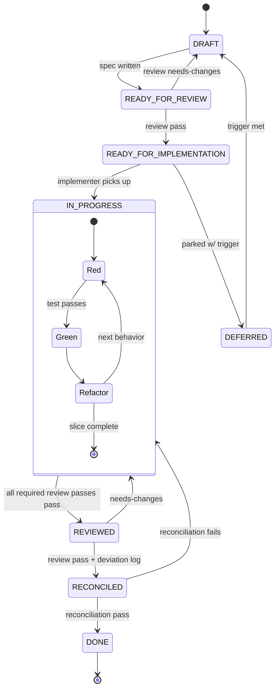

> Status: Draft (wizard-generated equivalent — manually seeded for jig itself)

# Workflow: jig

## How we build jig

We use the workflow jig is designed to produce — dogfooding from day one.

## Spec lifecycle

Every non-trivial piece of work gets a spec in `docs/specs/NNN-name/`. The
lifecycle is a forward path with three review-driven back-edges and a parked
sidetrack (`DEFERRED`), with TDD's red→green→refactor cycle nested inside
`IN_PROGRESS`:

Each forward transition is a checkpoint; each back-edge is a reasoning loop
(spec review, implementation review, reconciliation review, TDD). The
review-driven checkpoints are not honour-system prose: `workflow.py
transition` **refuses** the `REVIEWED` / `RECONCILED` / `DONE` moves unless
the required review evidence exists and passes (ADR-0014 §5 — see
[Post-implementation review](#post-implementation-review) and
[Reconciliation rules](#reconciliation-rules) below). No `Stop` hook is
involved — the only `Stop` hook, `jig-task-capture.sh`, is a task-capture
nudge that blocks nothing; the deterministic gate lives in the transition
helper. State names match `VALID_STATUSES` in
[skills/spec-workflow/workflow.py](../skills/spec-workflow/workflow.py).

## SPIDR splitting

All specs are SPIDR-split before implementation begins:

- **S — Spike**: last resort, not first. Only when none of P/I/D/R apply.
- **P — Path**: split by alternative paths through the story (happy path first).
- **I — Interface**: split by UI / platform / channel (minimal first, polish later).
- **D — Data**: split by data subset (less data first).
- **R — Rules**: split by business rules (simple first, edge cases later).

**Anti-horizontal-phasing guardrail**: every slice must touch the user-facing layer and deliver end-to-end value. A slice that only touches the DB is horizontal phasing.

## Session workflow

1. Check `docs/specs/README.md` for current status board.
2. Pick up the next `READY_FOR_IMPLEMENTATION` slice.
3. Spawn the `implementer` subagent with the spec path.
4. After the deliverable is on disk, run the post-implementation review (see "Post-implementation review" below — three passes via `jig:independent-review`, `pr-review`, and optionally `arch-review`).
5. Address reviewer findings; `[blocker]`-tagged craft/arch findings block the REVIEWED transition; `[nit]`-tagged ones become reconciliation-log items.
6. Run reconciliation: update `architecture.md` if module boundaries changed; annotate spec with deviation log; run + `record-review` the reconciliation review, then `workflow.py transition … RECONCILED` (gated on that evidence + the deviation log).
7. `workflow.py transition … DONE` (re-validates the full review-evidence set + dependencies). Update `docs/specs/README.md`.
8. Run `memory-sync` to consolidate learnings.

## Post-implementation review

Every slice goes through up to three review passes between IN_PROGRESS
and REVIEWED.

1. **Compliance pass — `jig:independent-review`** (always). A reviewer
   subagent with a fresh, self-contained prompt and read-only tools
   evaluates the deliverable against the slice's acceptance criteria.
   The prompt embeds a deterministic
   test-quality snapshot (spec 043-04 — `quality.py` reads the slice's
   merge-base-to-HEAD diff and reports `per-file-flood` /
   `assertion-thin` / `mock-heavy` signals) so findings can cite a
   fired signal by name. Verdict envelope: VERDICT / REASONING /
   SPECIFIC ISSUES / RECONCILIATION NOTES. `fail` or `needs-changes`
   blocks the transition.
2. **Craft pass — `pr-review`** (always). The reviewer subagent is
   read-only (Read/Glob/Grep, **no `Skill` tool**), so it cannot route to
   a skill via Claude's skill router. Instead `review.py` detects a
   user-installed `pr-review` skill on disk (`~/.claude/skills/pr-review/`)
   and points the reviewer at that concrete path to read-and-apply; absent
   one, it inlines jig's baseline buckets. (File-read dispatch — spec 031
   Open-question-#1 option (b); the original prose-router dispatch was inert
   on the no-Skill-tool subagent path.) Output: scope / blockers / nits /
   strengths, wrapped in the same verdict envelope; SPECIFIC ISSUES entries
   tagged `[blocker]` / `[nit]` / `[strength]`. Only `[blocker]`-tagged
   entries block; `[nit]` and `needs-changes` become reconciliation-log
   items.
3. **Arch pass — `arch-review`** (on-demand). Runs only when the
   slice's frontmatter declares `arch_review: true`. Same file-read
   dispatch (`~/.claude/skills/arch-review/`, else jig's baseline).
   Output: summary / strengths / concerns / open questions. Same block
   rule as the craft pass.

Order: compliance → craft → (arch if flagged). All required passes
must `pass` for the IN_PROGRESS → REVIEWED transition.

The reviewer's isolation is prompt- and tool-scoped — a self-contained
prompt plus read-only tools — not a hard sandbox (parent context is
technically reachable; see `skills/independent-review/SKILL.md`
§ Context isolation pattern). It works reliably when the prompt is sharp.

### Recording verdict evidence (the gate's input)

Each pass produces a **durable verdict artifact**, not ephemeral chat.
After a pass returns, record its verdict with `review.py record-review`,
which writes `docs/specs/NNN-slug/reviews/slice-NN-<pass>.md`
(`<pass>` ∈ `compliance` / `craft` / `arch` / `reconciliation`; schema
in `skills/_common/review_evidence.py`, ADR-0014 §1–3). The end-to-end
enforced path is:

1. **Build the prompt** — `review.py implementation|pr-review|arch-review`
   (compliance / craft / arch) builds the reviewer prompt; Claude spawns
   the reviewer subagent.
2. **Record the verdict** — `review.py record-review … --pass <pass>
   --verdict pass|fail|needs-changes …` writes the artifact beside the
   slice it grades.
3. **Run the gated transition** — `workflow.py transition <spec.md>
   <slice> REVIEWED`. The helper imports the same validator and **refuses**
   the move unless `compliance` + `craft` (+ `arch` when the slice
   declares `arch_review: true`) all exist and carry `verdict: pass`. A
   refusal names the missing/invalid artifact and the `record-review`
   command to produce it. (`review.py check-reviews … --stage REVIEWED`
   runs the same check ahead of the transition.)

The gate enforces **evidence consistency**, not human sign-off — it lives
inside the agent's trust boundary, so it is a *deliberateness* mechanism,
not human-only enforcement (ADR-0011, the same framing as the conventions
gate). A deliberate out-of-band flow can bypass it with
`JIG_REVIEW_EVIDENCE_GATE=0` (also `false`/`off`/`no`); the status still
transitions and the `DONE` dependency check still runs — only the evidence
check is skipped. The 003-04 auto-tick of the two review-passed DoD boxes
still happens, but now **after** the gate clears, so a ticked box always
has passing evidence behind it.

### Recovering from a failed review

A `fail` or `needs-changes` verdict blocks the `REVIEWED` transition (and a
`[blocker]`-tagged craft/arch finding likewise — it is recorded as a
non-`pass` verdict). To recover:

1. Address the reviewer's findings (adding regression tests for any real
   bug found).
2. Re-run the review pass against the updated deliverable.
3. `record-review` the new verdict — it **overwrites in place** the earlier
   file for that `(slice, pass)`, so the latest verdict is operative and
   git history keeps the prior one (ADR-0014 §4).
4. Re-run `workflow.py transition … REVIEWED`. With every required pass now
   `pass`, the gate clears. A non-`pass` artifact that was never overwritten
   by a later `pass` keeps blocking — that is exactly the "superseded
   without a later pass" case the gate is meant to catch.

## Reconciliation rules

After implementation, before marking DONE:

- Update specs with deviation log annotations (original ACs preserved).
- Update `architecture.md` ONLY if module boundaries or contracts changed (signal: write an ADR).
- ADRs are immutable after acceptance — new decisions supersede, never edit.
- Closed records (DONE / SUPERSEDED specs and slices) preserve drift via a
  `## Amendments` section ([ADR-0010](decisions/adr-0010-amendment-scope-records-vs-live-prose.md));
  run `python3 skills/spec-workflow/workflow.py amendments` for a read-only
  digest of the current overrides so you don't have to reread each
  historical block to find effective state.
- `docs/conventions.md` changes require explicit human approval. The
  `jig-spec-gate` hook backstops this rule — but it is a *deliberateness*
  gate that catches accidental side-effect edits, not a hard human-only
  guarantee (the env var is satisfiable by any shell, including the agent's).
  Where a team needs mechanical human-only enforcement, use an out-of-band
  channel — `CODEOWNERS` on the file, a CI check on the PR diff, or branch
  protection. See [ADR-0011](decisions/adr-0011-spec-gate-model.md).
- A second reviewer pass runs on the reconciliation itself. Record its
  verdict with `review.py record-review … --pass reconciliation`, then
  `workflow.py transition <spec.md> <slice> RECONCILED`. That move is
  **gated** (ADR-0014 §5): it refuses unless the `reconciliation` verdict
  is recorded and `pass` **and** a `### Deviation log` subsection is present
  under the slice heading (the reviewer attests the log's content; the gate
  only checks the heading is there). `transition … DONE` re-validates the
  whole set — `compliance` + `craft` (+ `arch`) + `reconciliation` — on top
  of the existing `dependencies:` check, so a hand-edited status can't walk
  past a gate an earlier transition enforced.

## Context-cost discipline

**The orchestrator's context is the most expensive real estate in the
system.** It is re-read on every turn for the whole session, so its cost is
roughly *context-size × number-of-turns*. Measured on jig's own development:
~90% of cost is the orchestrator (subagents ~8%), ~97% of token *volume* is
`cache_read` — the main session re-reading its accumulated context — and the
always-loaded primer (CLAUDE.md + `docs/memory/*`) is only ~4% of a heavy
session's reads. The lesson: the baseline is cheap; **in-session growth** is
the cost. Keep the orchestrator lean — every token that enters it is paid for
again on every subsequent turn.

This is a *cost* argument that lands on the same place as the "dumb zone"
*quality* argument (>40% context fill degrades recall): both say keep the
orchestrator lean.

### Delegate file-heavy reading

**Rule:** when a step will read more than a couple of files, or scan a
large/unknown area, delegate it to a read-only subagent and keep only the
returned summary in the orchestrator. The subagent reads, searches, and
analyzes in its own bounded, disposable context; that bulk never enters — and
is never re-read by — the main session.

- **Target:** the built-in `Explore` / `general-purpose` agents (via the
  `Task` tool). These run read-only in an isolated context. This is context
  isolation, *not* parallelism.
- **Return shape:** the subagent returns a **compact structured summary** —
  the findings, the relevant paths, the load-bearing snippets — and
  **never raw file contents**. The orchestrator keeps the summary, not the
  files.

**Reuse decision (recorded inline):** jig deliberately **reuses** the built-in
`Explore` / `general-purpose` agents rather than shipping its own
explorer/analyst agent. Rationale: the built-ins are read-only and capable;
adding a jig agent would only duplicate a capable built-in. Revisit only if
their return contract proves insufficient for jig's summary needs. (No ADR —
the choice is low-stakes and reversible; no `agents/*.md` file is added.)

### Read once, read lean

Read is the single biggest one-time context source (~26% of orchestrator
context on jig's own development). The two most common Read-side wasters:

- **Don't re-Read what's already in context.** Once a file has been Read this
  session, its contents are still loaded — re-reading adds the whole file
  again, and the orchestrator is re-read on *every* subsequent turn, so the
  cost compounds. Reuse the copy already in context. In the "$540 session"
  (below) a single `spec.md` was re-read **42×**.
- **Prefer Grep-to-locate plus a ranged Read over a whole-file scan.** When
  you need a specific part of a large file, `Grep` to find the line(s), then
  Read with `offset` / `limit` to pull just that range. Reading a large file
  whole lands the entire file in context for no reason.

A soft `PreToolUse` (matcher: `Read`) hook nudges on both — a duplicate read
of the same path (at most once per path per session) and a whole-file Read of
a file above `JIG_READ_LEAN_BYTES` (default 64 KiB). It never blocks; it is
guidance, not a gate.

### Keep verbose command output out of the orchestrator

Bash output is ≈ 19% of one-time orchestrator context — and a single dumped
test run or build log is then re-read on every subsequent turn. **Rule:**
verbose command output (full test runs, builds, long `git log` / `git diff`)
belongs in a subagent, or must be reduced to a summary before it enters
orchestrator context.

- **Run the suite via the implementer.** The `implementer` agent runs its own
  test/build commands in its bounded context and surfaces only the result —
  pass/fail plus the key failing lines, never the full log. The verbose output
  is paid for once, in a disposable context.
- **For a one-off command you must run in the orchestrator, summarize before
  the output lands.** Prefer a runner's summarizing/quiet flag (e.g. `pytest -q`,
  `--reporter=dot`) and a bounded VCS view (`git log --oneline -10`,
  `git diff --stat`) over dumping the whole thing. When you only need a
  magnitude, **pipe to a count** (`… | wc -l`, `grep -c`) rather than reading
  every line.

### Worked example: the "$540 session"

A codebase-gap review run *entirely in the orchestrator* (spec 008's
`quizzical-moore` worktree) read and reasoned over the whole codebase in the
main session: **985 turns**, only one context reset, context climbing to
~840K tokens — **≈$540** for a single session, because every file read stayed
in context and was re-read on every one of those turns.

- **DON'T:** run a codebase-gap review (or any read-heavy survey) turn after
  turn in the orchestrator, accumulating file contents it will re-read every
  turn.
- **DO:** delegate the reading/analysis to `Explore` and keep only its
  returned summary. The bulk reading happens once, in a disposable context;
  the orchestrator pays for the summary, not the corpus.

## Hook strictness profiles

> **Deferred** — see `docs/refinement-todo.md`. Plan: `minimal | standard | strict`, controlled via `SCAFFOLD_HOOK_PROFILE` env var. Not yet implemented.

## Skill invocation

Skills auto-trigger via description matching. No explicit `/command` required for day-to-day work. Slash commands exist for deliberate bulk operations (`/jig:memory-sync`, `/jig:scaffold-init`).

The spec-workflow, independent-review, and contracts skills all auto-trigger via description matching and carry `user-invocable: true` — none carry `disable-model-invocation: true` (promotions: spec 003 / 004 / 022).
