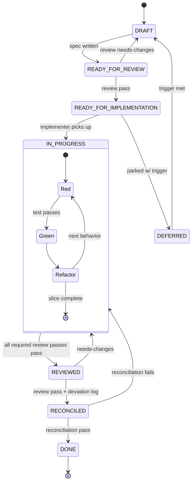

> Status: Draft (wizard-generated equivalent — manually seeded for jig itself)

# Workflow: jig

## How we build jig

We use the workflow jig is designed to produce — dogfooding from day one.

## Spec lifecycle

Every non-trivial piece of work gets a spec in `docs/specs/NNN-name/`. The
lifecycle is a forward path with three review-driven back-edges and a parked
sidetrack (`DEFERRED`), with TDD's red→green→refactor cycle nested inside
`IN_PROGRESS`:

Each forward transition is a checkpoint; each back-edge is a reasoning loop
(spec review, implementation review, reconciliation review, TDD). The Stop
hook blocks completion if reconciliation hasn't happened. State names match
`VALID_STATUSES` in [skills/spec-workflow/workflow.py](../skills/spec-workflow/workflow.py).

## SPIDR splitting

All specs are SPIDR-split before implementation begins:

- **S — Spike**: last resort, not first. Only when none of P/I/D/R apply.
- **P — Path**: split by alternative paths through the story (happy path first).
- **I — Interface**: split by UI / platform / channel (minimal first, polish later).
- **D — Data**: split by data subset (less data first).
- **R — Rules**: split by business rules (simple first, edge cases later).

**Anti-horizontal-phasing guardrail**: every slice must touch the user-facing layer and deliver end-to-end value. A slice that only touches the DB is horizontal phasing.

## Session workflow

1. Check `docs/specs/README.md` for current status board.
2. Pick up the next `READY_FOR_IMPLEMENTATION` slice.
3. Spawn the `implementer` subagent with the spec path.
4. After the deliverable is on disk, run the post-implementation review (see "Post-implementation review" below — three passes via `jig:independent-review`, `pr-review`, and optionally `arch-review`).
5. Address reviewer findings; `[blocker]`-tagged craft/arch findings block the REVIEWED transition; `[nit]`-tagged ones become reconciliation-log items.
6. Run reconciliation: update `architecture.md` if module boundaries changed; annotate spec with deviation log; run reconciliation review.
7. Update spec status to `DONE`. Update `docs/specs/README.md`.
8. Run `memory-sync` to consolidate learnings.

## Post-implementation review

Every slice goes through up to three review passes between IN_PROGRESS
and REVIEWED.

1. **Compliance pass — `jig:independent-review`** (always). A reviewer
   subagent with a fresh, self-contained prompt and read-only tools
   evaluates the deliverable against the slice's acceptance criteria.
   The prompt embeds a deterministic
   test-quality snapshot (spec 043-04 — `quality.py` reads the slice's
   merge-base-to-HEAD diff and reports `per-file-flood` /
   `assertion-thin` / `mock-heavy` signals) so findings can cite a
   fired signal by name. Verdict envelope: VERDICT / REASONING /
   SPECIFIC ISSUES / RECONCILIATION NOTES. `fail` or `needs-changes`
   blocks the transition.
2. **Craft pass — `pr-review`** (always). Routes to the most-specific
   installed `pr-review` skill (user > project > `jig:pr-review`) via
   the Claude Code skill router. Output: scope / blockers / nits /
   strengths, wrapped in the same verdict envelope; SPECIFIC ISSUES
   entries tagged `[blocker]` / `[nit]` / `[strength]`. Only
   `[blocker]`-tagged entries block; `[nit]` and `needs-changes`
   become reconciliation-log items.
3. **Arch pass — `arch-review`** (on-demand). Runs only when the
   slice's frontmatter declares `arch_review: true`. Routes to the
   most-specific installed `arch-review` skill (user > project >
   `jig:arch-review`). Output: summary / strengths / concerns / open
   questions. Same block rule as the craft pass.

Order: compliance → craft → (arch if flagged). All required passes
must `pass` for the IN_PROGRESS → REVIEWED transition.

The reviewer's isolation is prompt- and tool-scoped — a self-contained
prompt plus read-only tools — not a hard sandbox (parent context is
technically reachable; see `skills/independent-review/SKILL.md`
§ Context isolation pattern). It works reliably when the prompt is sharp.

## Reconciliation rules

After implementation, before marking DONE:

- Update specs with deviation log annotations (original ACs preserved).
- Update `architecture.md` ONLY if module boundaries or contracts changed (signal: write an ADR).
- ADRs are immutable after acceptance — new decisions supersede, never edit.
- `docs/conventions.md` changes require explicit human approval.
- A second reviewer pass runs on the reconciliation itself.

## Hook strictness profiles

> **Deferred** — see `docs/refinement-todo.md`. Plan: `minimal | standard | strict`, controlled via `SCAFFOLD_HOOK_PROFILE` env var. Not yet implemented.

## Skill invocation

Skills auto-trigger via description matching. No explicit `/command` required for day-to-day work. Slash commands exist for deliberate bulk operations (`/jig:memory-sync`, `/jig:scaffold-init`).

Skills marked `disable-model-invocation: true` (spec-workflow, independent-review, contracts) are stubs — they appear in the menu but do not auto-trigger until implemented.

## Amendments

### 2026-05-27 — spec-workflow, independent-review, contracts auto-trigger

The "Skill invocation" paragraph above (line 114) claims spec-workflow,
independent-review, and contracts are stubs carrying
`disable-model-invocation: true` and do not auto-trigger. That is no
longer accurate: none of the three carry that flag today; all three
have `user-invocable: true` in their frontmatter and auto-trigger via
description matching. The promotions landed as: spec 003 (spec-workflow),
spec 004 (independent-review), spec 022 (contracts). Original prose
preserved above per
[ADR-0008](decisions/adr-0008-closed-spec-drift-policy.md) Option C;
this amendment overrides it.

- Link: [spec 003 — spec-workflow promotion](specs/003-spec-workflow-promotion/spec.md)
- Link: [spec 004 — independent-review promotion](specs/004-independent-review-promotion/spec.md)
- Link: [spec 022 — contracts](specs/022-contracts/spec.md)

