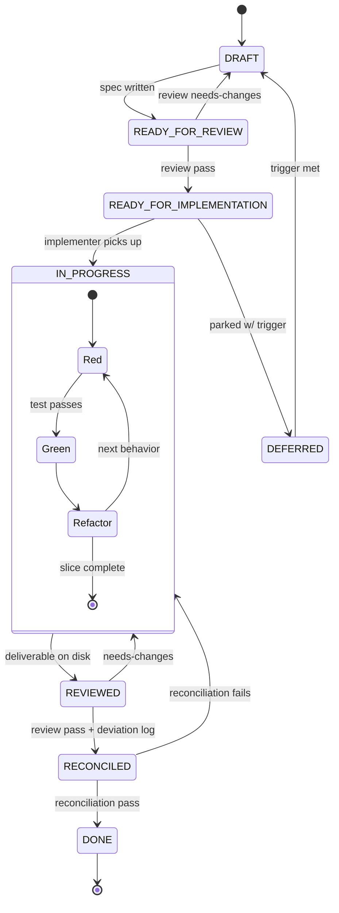

> Status: Draft (wizard-generated equivalent — manually seeded for jig itself)

# Workflow: jig

## How we build jig

We use the workflow jig is designed to produce — dogfooding from day one.

## Spec lifecycle

Every non-trivial piece of work gets a spec in `docs/specs/NNN-name/`. The
lifecycle is a forward path with three review-driven back-edges and a parked
sidetrack (`DEFERRED`), with TDD's red→green→refactor cycle nested inside
`IN_PROGRESS`:

Each forward transition is a checkpoint; each back-edge is a reasoning loop
(spec review, implementation review, reconciliation review, TDD). The Stop
hook blocks completion if reconciliation hasn't happened. State names match
`VALID_STATUSES` in [skills/spec-workflow/workflow.py](../skills/spec-workflow/workflow.py).

## SPIDR splitting

All specs are SPIDR-split before implementation begins:

- **S — Spike**: last resort, not first. Only when none of P/I/D/R apply.
- **P — Path**: split by alternative paths through the story (happy path first).
- **I — Interface**: split by UI / platform / channel (minimal first, polish later).
- **D — Data**: split by data subset (less data first).
- **R — Rules**: split by business rules (simple first, edge cases later).

**Anti-horizontal-phasing guardrail**: every slice must touch the user-facing layer and deliver end-to-end value. A slice that only touches the DB is horizontal phasing.

## Session workflow

1. Check `docs/specs/README.md` for current status board.
2. Pick up the next `READY_FOR_IMPLEMENTATION` slice.
3. Spawn the `implementer` subagent with the spec path.
4. After deliverable is on disk, trigger `independent-review`.
5. Address reviewer findings.
6. Run reconciliation: update `architecture.md` if module boundaries changed; annotate spec with deviation log; run reconciliation review.
7. Update spec status to `DONE`. Update `docs/specs/README.md`.
8. Run `memory-sync` to consolidate learnings.

## Reconciliation rules

After implementation, before marking DONE:

- Update specs with deviation log annotations (original ACs preserved).
- Update `architecture.md` ONLY if module boundaries or contracts changed (signal: write an ADR).
- ADRs are immutable after acceptance — new decisions supersede, never edit.
- `docs/conventions.md` changes require explicit human approval.
- A second reviewer pass runs on the reconciliation itself.

## Hook strictness profiles

> **Deferred** — see `docs/refinement-todo.md`. Plan: `minimal | standard | strict`, controlled via `SCAFFOLD_HOOK_PROFILE` env var. Not yet implemented.

## Skill invocation

Skills auto-trigger via description matching. No explicit `/command` required for day-to-day work. Slash commands exist for deliberate bulk operations (`/jig:memory-sync`, `/jig:scaffold-init`).

Skills marked `disable-model-invocation: true` (spec-workflow, independent-review, contracts) are stubs — they appear in the menu but do not auto-trigger until implemented.
